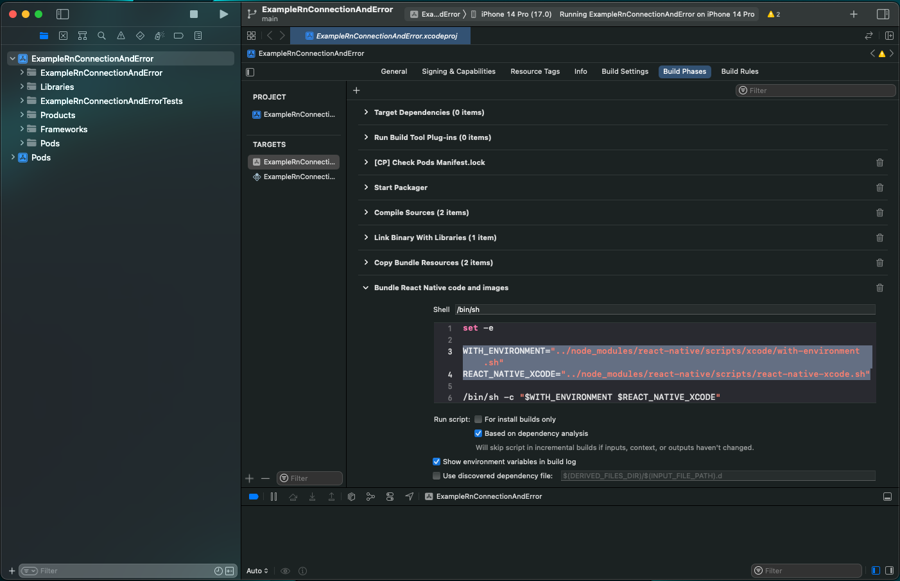

# How to Debug using React Native Examples

## Steps to link local `realm` and `@realm/react` to examples

### 1. Add example to `workspaces` in `package.json`
For example, to add `rn-todo-list` one would add it to the root `package.json` file like so:
```json
...
"workspaces": [
	"examples/rn-todo-list/frontend/",
	"packages/realm/bindgen/",
	"packages/realm/bindgen/vendor/realm-core/",
	"packages/babel-plugin",
...
```

### 2. Update relative paths to `node-modules` in native configurations

The following shows how to point to the root `node_modules` directory, rather than to the example's local one.

#### iOS as of `react-native@0.72.6`

Open the `xcworkspace` in Xcode:
```
open ios/*.xcworkspace
```

Open the build phase settings as shown in the following screenshot:




Edit the highlighted lines with the following:

```bash
WITH_ENVIRONMENT="../../../../node_modules/react-native/scripts/xcode/with-environment.sh"
REACT_NATIVE_XCODE="../../../../node_modules/react-native/scripts/react-native-xcode.sh"
```

####  Android as of `react-native@0.72.6`

The following files will require updates:
`android/app/build.gradle`

at line 13 uncomment and modify `reactNativeDir`
```gradle
     //   The folder where the react-native NPM package is. Default is ../node_modules/react-native
-    // reactNativeDir = file("../node_modules/react-native")
+    reactNativeDir = file("../../../../../node_modules/react-native")
```

and update line 123

```gradle
-apply from: file("../../node_modules/@react-native-community/cli-platform-android/native_modules.gradle"); applyNativeModulesAppBuildGradle(project)
+apply from: file("../../../../../node_modules/@react-native-community/cli-platform-android/native_modules.gradle"); applyNativeModulesAppBuildGradle(project)
```

`android/settings.gradle`

lines 2 and 4 should be updated

```gradle
-apply from: file("../node_modules/@react-native-community/cli-platform-android/native_modules.gradle"); applyNativeModulesSettingsGradle(settings)
+apply from: file("../../../../node_modules/@react-native-community/cli-platform-android/native_modules.gradle"); applyNativeModulesSettingsGradle(settings)
 include ':app'
-includeBuild('../node_modules/@react-native/gradle-plugin')
+includeBuild('../../../../node_modules/@react-native/gradle-plugin')
```

### 3. Apply our custom `metro` config
We have a custom `metro` configuration which will help find any linked dependencies in the mono-repo.  First add it to the `devDependencies` in the example's `package.json`:

```json
devDependencies: {
	...
	"@realm/metro-config": "*",
	...
}
```

Then replace the `metro.config.js` with the following:

```js
module.exports = require("@realm/metro-config")({
  projectRoot: __dirname,
});
```


### 4. Install dependencies fresh and rebuild the application
Now the app should be using `realm` and `@realm/react` from source.

```bash
npm install
# for ios
npx pod-install
npm run ios
# for android
npm run android
```

## Don't Commit Changes

Since we want to keep the simplicity for our users, changes made in order to debug (such as modifications to `node_modules` paths) should only be made locally and are not to be committed.

## Common Issues

### Android or iOS doesn't find Realm.

Make sure to build binaries for Android and iOS in packages/realm by running:

```
npm run build:ios --workspace=realm
```
or

```
npm run build:android --workspace=realm
```

### Building failed
If React Native was upgraded, it's possible building will.  This is a great opportunity
for you to help the team out and create an update to this document! Do a search in the `android` or `ios` directory for any references to `node_modules` and make sure they are relative paths to the root `node_modules` directory.

### Bundler can't find React Native or other source files
If React Native or any of its dependencies were updated in our mono-repo, then this needs to happen
in the rest of the packages in order for this version to land in the root `node_modules`, which is what
our patch expects.  Make sure the examples' React Native version is the same as the rest of the mono-repo,
otherwise React Native will be placed in the local examples' `node_modules`.
