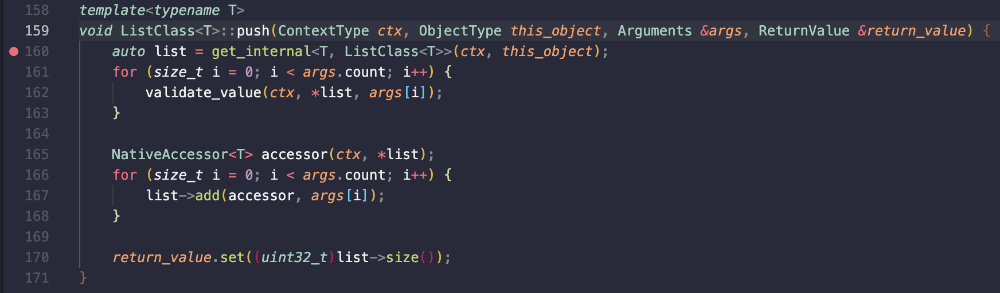
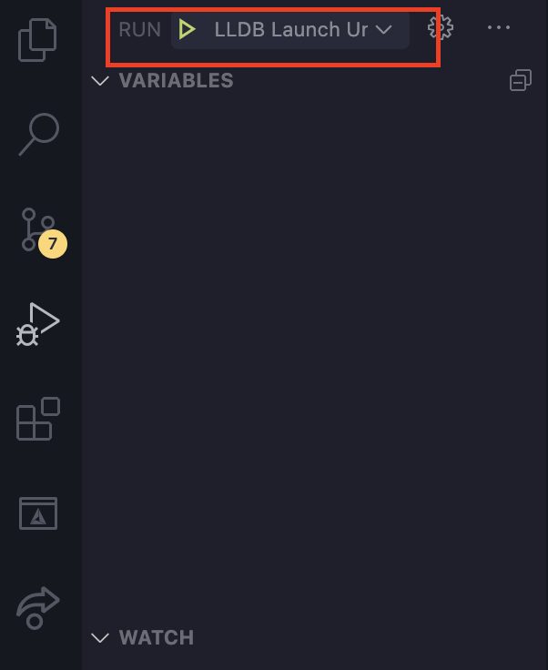
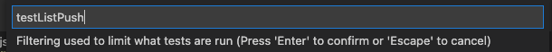
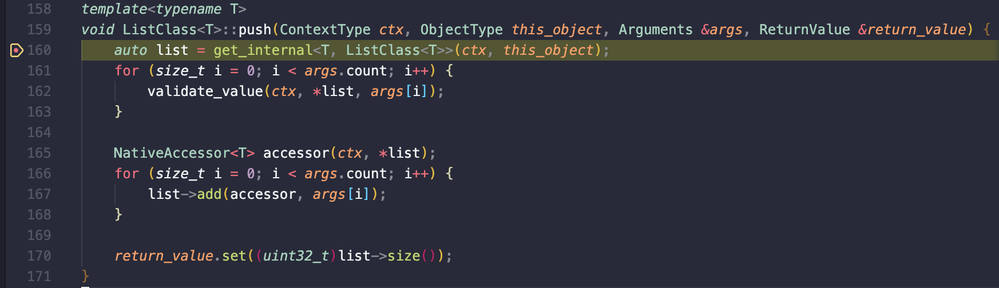

# Debugging C++

<!-- TOC generated with https://github.com/ekalinin/github-markdown-toc : gh-md-toc --insert --no-backup --hide-footer contrib/debugging-cpp.md -->

<!--ts-->
* [Debugging C++](#debugging-c)
* [Quick start](#quick-start)
   * [Setup](#setup)
   * [Debugging Realm Unit Tests through Example](#debugging-realm-unit-tests-through-example)
* [Details on debugging C++](#details-on-debugging-c)
   * [Visual Studio Code configurations](#visual-studio-code-configurations)
      * [Configuration: LLDB Debug Unit Tests](#configuration-lldb-debug-unit-tests)
      * [Configuration: LLDB Debug Integration Tests](#configuration-lldb-debug-integration-tests)
      * [Configuration: LLDB Node REPL](#configuration-lldb-node-repl)
      * [Configuration: LLDB Attach to Process](#configuration-lldb-attach-to-process)
   * [Working with lldb in VS Code](#working-with-lldb-in-vs-code)
      * [Breaking on exceptions](#breaking-on-exceptions)
      * [Inspecting/interacting with variables when paused](#inspectinginteracting-with-variables-when-paused)
      * [Advanced features](#advanced-features)
   * [Using a debug version of Node](#using-a-debug-version-of-node)
      * [Compiling a debug version of Node](#compiling-a-debug-version-of-node)
      * [Using a debug version of Node](#using-a-debug-version-of-node-1)
   * [Debugging Realm C++ in an iOS app using Xcode](#debugging-realm-c-in-an-ios-app-using-xcode)
   * [Debugging Realm C++ in an Android app using Android Studio](#debugging-realm-c-in-an-android-app-using-android-studio)
   * [Other C++ debugging tricks](#other-c-debugging-tricks)
      * [Inspecting the type of an auto variable](#inspecting-the-type-of-an-auto-variable)
      * [Using Instruments to profile Node code](#using-instruments-to-profile-node-code)
<!--te-->

# Quick start

## Setup

First make sure your environment is setup by following the [building instructions](./building.md)

Then you will need the following plugins for VSCode:
* [C/C++ by Microsoft](https://github.com/Microsoft/vscode-cpptools)
* [CodeLLDB](https://github.com/vadimcn/vscode-lldb)

## Debugging Realm Unit Tests through Example

First lets take a look at `.vscode/launch.json`.  This contains various ways to launch commands from vscode.  For this example we will look at the command `LLDB Debug Unit Tests`.

```json
{
    "type": "lldb",
    "request": "launch",
    "name": "LLDB Debug Unit Tests",
    "program": "node",
    "args": [
        "--expose_gc",
        "${workspaceFolder}/tests/node_modules/jasmine/bin/jasmine.js",
        "spec/unit_tests.js",
        "--filter=${input:testFilter}"
    ],
    "cwd": "${workspaceFolder}/tests",
    "preLaunchTask": "Build Node Tests"
}
```

A quick read through this code shows that the launch type is `lldb` provided by the CodeLLDB extension, and it is using the `node` command to invoke the `jasmine` test framework with our `spec/unit_tests.js`. The `${input:testFilter}` will prompt us for a string to use as filter to avoid running all tests every time. The `preLaunchTask` will compile Realm JS in debug mode before starting the debug session.

When prompted for a filter, try using "testListPush" as the input. As we are fairly certain this will perform a `push` command on a realm list, we can place a breakpoint in the push function in `src/js_list.hpp` by locating the push function and clicking next to the desired line number (see example below)



Now we can run the test and see what happens.  Click on the debug tab in the left bar of vscode:


Select the `LLDB Launch Unit Tests` from the run tab:



Now press play, type "testListPush" as filter and hit <kbd>Enter</kbd>



We should now arrive at our new breakpoint.



To run all tests, simply leave the filter at the default (`.`).

# Details on debugging C++

## Visual Studio Code configurations

Visual Studio Code with the [CodeLLDB](https://marketplace.visualstudio.com/items?itemName=vadimcn.vscode-lldb) extension provides a good experience for debugging C++ code using the `lldb` debugger.

The [launch.json](https://github.com/realm/realm-js/blob/main/.vscode/launch.json) file contains various useful debugger launch configurations which attach `lldb` to the `node` process so that breakpoints can be set and exceptions can be caught. These profiles can be seected from the list in the top right of the "Run and Debug" pane in VS Code.

All the launch configurations are configured to [compile Realm JS in debug mode](https://github.com/realm/realm-js/blob/main/.vscode/launch.json#L98) before starting the debug session, so you do not need to remember to compile between sessions.

### Configuration: LLDB Debug Unit Tests

This configuration will run the [unit tests](https://github.com/realm/realm-js/tree/main/tests) with `lldb` attached. By default, it will ask for the filter for the run each time you invoke it. If you are debugging a specific test, it can save time if you temporarily hardcode the filter: https://github.com/realm/realm-js/blob/main/.vscode/launch.json#L88.

### Configuration: LLDB Debug Integration Tests

This configuration will run the [integration tests](https://github.com/realm/realm-js/tree/main/tests) with `lldb` attached. By default, it will ask for the grep pattern for the run each time you invoke it. If you are debugging a specific test, it can save time if you temporarily hardcode the filter: https://github.com/realm/realm-js/blob/main/.vscode/launch.json#L117.

A pre-requisite for running these tests is to start the [https://github.com/realm/realm-js/blob/main/packages/realm-app-importer](`realm-app-importer`) script in a terminal, by running: `npx lerna bootstrap --scope @realm/integration-tests --include-dependencies && cd integration-tests/tests && npm run app-importer` – this is usually started automatically when you run the tests, but as we need to connect `lldb` directly to the `node` instance that is running the tests, you need to start it manually.

### Configuration: LLDB Node REPL

This configuration starts a `node` REPL with the debugger attached. This allows you to easily evaluate statements and jump into the C++ debugger. If you are running the same commands over and over, you may want to save these to a temporary `.js` file and add this file's path to the `args` in https://github.com/realm/realm-js/blob/main/.vscode/launch.json#L98, so that `node` runs this script instead of a REPL.

### Configuration: LLDB Attach to Process

This configuration will attach `lldb` to a running process. This can be useful for debugging Electron applications, for example, in which case you might want to connect the debugger to the `main.js` process.

When this configuration is run, it will open a process picker. You should be able to identify the correct process by searching for a known string in the application name, though it might require some trial and error!

## Working with lldb in VS Code

### Breaking on exceptions

It can be helpful to tick the `C++: on throw` and/or `C++: on catch` default breakpoints, in order to catch exceptions.

### Inspecting/interacting with variables when paused

It is sometimes possible to get useful information on variables via the "Variables" panel in the debug pane, but sometimes it is not that helpful (e.g. with NAPI objects which just show as a memory address), or you might want to call methods on an instance rather than just inspect it.

The `lldb` `p` command can be used in the "Debug Console" pane (to the right of the terminal) to do this when you are paused at a breakpoint – you can inspect/interact with anything in the scope of the current breakpoint, for example `p my_array.size()` or `p napi_object.Type()`.

Note that this might not always work, e.g. sometimes it can crash when trying to inspect certain properties, in which case a useful technique is to add a line of code storing the value you are interested in temporarily so that you can inspect it in the variables window, e.g. `auto temp_type = napi_object.Type();`.

### Advanced features

There are many useful advanced `lldb` features, for example:
- you can add a breakpoint whenever a named method is called, even if you can't locate it in the source, with `br s -M method_name`, e.g. `br s -M ~realm::js::MyClass` to break whenever `realm::js::MyClass`'s destructor is called
- you can print the memory address of a variable with `expr --raw -- &variable_name`, which can be useful when trying to work out if you are accidentally working with a copy of an object
- you can make it break whenever a certain variable is read or modified, by right clicking on it in the Variables pane and clicking "Break on Value Read/Change/Access".

The [`lldb` documentation](https://lldb.llvm.org/) and the [`CodeLLDB` documentation](https://github.com/vadimcn/vscode-lldb/blob/master/MANUAL.md) are useful resources.

## Using a debug version of Node

It can sometimes be useful to use a debug version of Node. This allows you to view the source code of Node and v8 when inspecting stack traces, rather than the assembly code, and can also yield more useful stack traces when debugging deep C++ integration issues.

### Compiling a debug version of Node

1. Download the source code from https://nodejs.org/en/download/
2. Unzip the source code to wherever you want to keep the debug version of Node (note that the debug symbol paths get hardcoded, so you need to recompile if you move it around after compilation)
3. From the root of the Node source directory, run `./configure --debug -C` – this configures the build in debug mode, and `-C` outputs `compile_commands.json` so that you can get better debug information in VS Code.
4. Run `make -j32` to compile Node. `-j32` specifies the number of jobs to run in parallel – it seems that 2x the number of threads (which is 2x the number of cores) is recommended. You can play around with different values – 32 seems to saturate the CPU of a Macbook Pro 16" (which has 8 cores = 16 threads), while still leaving it usable, and compiles in under half an hour.

### Using a debug version of Node

To use a debug version of Node, change the path to `node` for the `lldb` launch configuration you are using to point to the debug version you compiled above, e.g. change https://github.com/realm/realm-js/blob/main/.vscode/launch.json#L103 to `"program": "/Users/my_name/dev/node-v16.13.2/out/Debug/node"`. You should now get full source code in stack traces.

You can also open the Node source directory in VS Code and use the launch config from https://joyeecheung.github.io/blog/2018/12/31/tips-and-tricks-node-core/ (which has some other useful tips) if you wish to go deeper into the Node source code.

## Debugging Realm C++ in an iOS app using Xcode

To debug Realm C++ in an iOS app using Xcode:

1. Ensure you are using a debug version of the Realm `xcframework` (`./scripts/build-ios.sh -c Debug simulator`)
2. In your Xcode project, go to `File` > `Add files to <project name>` and select your `realm-js/src` directory (it must be the same directory you used to build the `xcframework` as the paths are absolute). Ensure "Copy items" is not ticked, and "Create folder references" is selected, then press `Add`.
3. Repeat step 2, for your `realm-js/vendor/realm-core/src` directory.
4. Build and run the app in debug mode.

You should now be able to navigate to Realm C++ source files and add breakpoints by navigating to the source files in the Project navigator.

## Debugging Realm C++ in an Android app using Android Studio

To debug Realm C++ in an Android app using Android Studio (the integration test is already set up to do this so you shouldn't need to do it for that):

1. Ensure you are using a debug version of the Realm `.so` (`node scripts/build-android.js  --arch=x86 --build-type=Debug`)
2. Prevent Gradle from stripping debug symbols from Realm by adding to your `app/build.gradle` in the `android.buildTypes.debug` section:
   ```
   // Do not strip debug symbols from the Realm library
   packagingOptions {
         jniLibs.keepDebugSymbols += "**/librealm.so"
   }
   ```
3. Add the source paths for Realm to the project by adding the paths (which can be relative to the `build.gradle` file) to your `app/build.gradle` in the `android` section:
   ```
   // Add the Realm source files to the Android Studio project so that we can add breakpoints
   // in debug mode. These will not be compiled, it will still use the .so library.
   sourceSets {
      main.java.srcDirs += '<path to realm-js/src>'
      main.java.srcDirs += '<path to realm-js/vendor/realm-core/src>'
   }
   ```
4. In Android Studio, go to `Run` > `Edit Configurations...` and in the `Debugger` tab, select a `Debug type` of `Native Only`
5. In the same window, add a `LLDB Startup Command` entry of `process handle --pass true --stop false --notify true SIGUSR1`. This prevents it from breaking on signals used internally in React Native.
6. Build and run the app in debug mode.

You should now be able to navigate to Realm C++ source files and add breakpoints by navigating to the "Project Files" view (using the "Project" dropdown in the top left file browser).

### Debugging Realm C++ in an Android app using lldb

You can also start `lldb-server` on the Android emulator and connect to it directly from another client (e.g. `lldb` or the VS Code LLDB plugin). You need to be using a rooted emulator (i.e. one of the images without Google Play).

1. Follow steps 1, 2 and 4 of the Android Studio debugging instructions (you do not have to leave it in "Native Only" debugging, but need to do this at least once so `lldb-server` is installed on the device)
2. Build and run the app in debug mode
3. Run `adb shell` to open a shell on the emulator
4. Run `su` to become root
5. Run `ps -A | grep com.yourapp`, replacing `com.yourapp` with your app's bundle ID, to get the PID (you can also see this in the Android Studio Debug tab)
5. Run `/data/data/com.yourapp/lldb/bin/lldb-server platform --server --listen "*:9123"`, replacing `com.yourapp` with your app's bundle ID (e.g. `com.realmreactnativetests`) This will start `lldb-server` running over TCP so you can connect to it.
6. In a separate local shell, run `adb forward tcp:9123 tcp:9123` to forward the `lldb-server` port to your local machine

If you would like to make this happen on every startup, you can modify the script which Android Studio installs on to the device to always start `lldb-server` in TCP mode:
1. Open `/Applications/Android\ Studio.app/Contents/plugins/android-ndk/resources/lldb/android/start_lldb_server.sh` in a text editor
2. Modify the last line to e.g. `$BIN_DIR/lldb-server platform --server --listen "*:9123" & $BIN_DIR/lldb-server platform --server --listen $LISTENER_SCHEME://$DOMAINSOCKET_DIR/$PLATFORM_SOCKET --log-file "$PLATFORM_LOG_FILE" --log-channels "$LOG_CHANNELS" </dev/null >$LOG_DIR/platform-stdout.log 2>&1`

#### Connecting with `lldb`

To connect to the running server with `lldb`:

1. Run `lldb`
2. `platform select remote-android`
3. `platform connect connect://localhost:9123`
4. `attach PID`, replacing PID with your app's PID

#### Connecting with VS Code

1. Open VS Code with the relevant source files (make sure you use the same directory which Realm JS was compiled in)
2. Run the [LLDB Attach to Android Emulator] debug launch config
3. Enter the app's PID at the prompt

## Other C++ debugging tricks

### Inspecting the type of an `auto` variable

Sometimes it can be non-obvious what type an `auto` variable has. The debugger can potentially help you here, by adding a breakpoint then inspecting the type in the Variables pane, but an alternative approach is to use the following template trick (from https://stackoverflow.com/a/38820784/17700221):

1. Add `template<typename T> struct TD;` somewhere at the top level of a header file before the code you are looking at (probably in the `.hpp` file you are working with, just above the method in question, for Realm JS)

2. Add `TD<decltype(variable_name)> td;` after the variable (`variable_name`) who's type you want to inspect.

3. Now when you compile, you will get an error like `error: implicit instantiation of undefined template 'realm::js::TD<const realm::ObjectSchema &>'` – the type parameter of `TD` is the type of the variable in question, in this case `const realm::ObjectSchema &`.

### Using Instruments to profile Node code

To run a Node script and capture a performance trace to analyse in Instruments, you can run it like: `xcrun xctrace record --template 'Time Profiler' --target-stdout - --launch -- ~/.nvm/versions/node/v16.13.2/bin/node index.js`.

Using a debug version of Realm (e.g. compile Realm in debug mode, then `npm i ~/dev/realm-js` to install your local version into your Node project) may yield more useful information.
