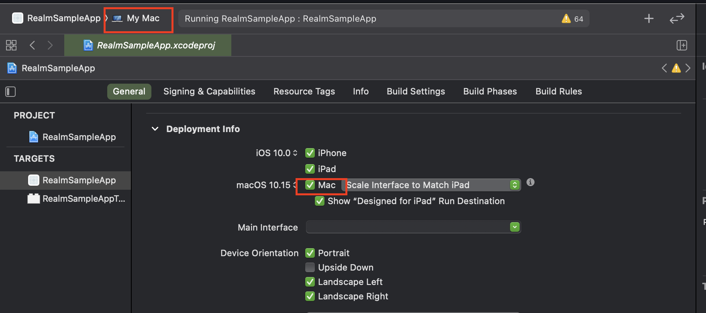
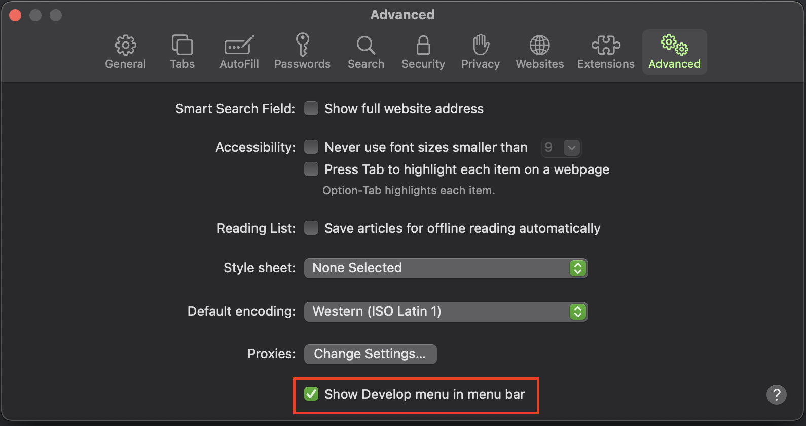
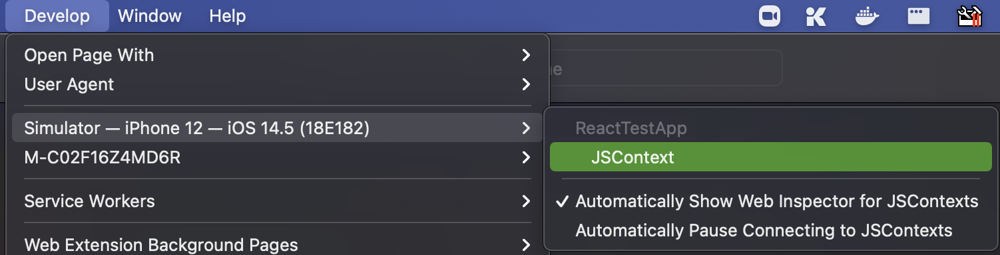
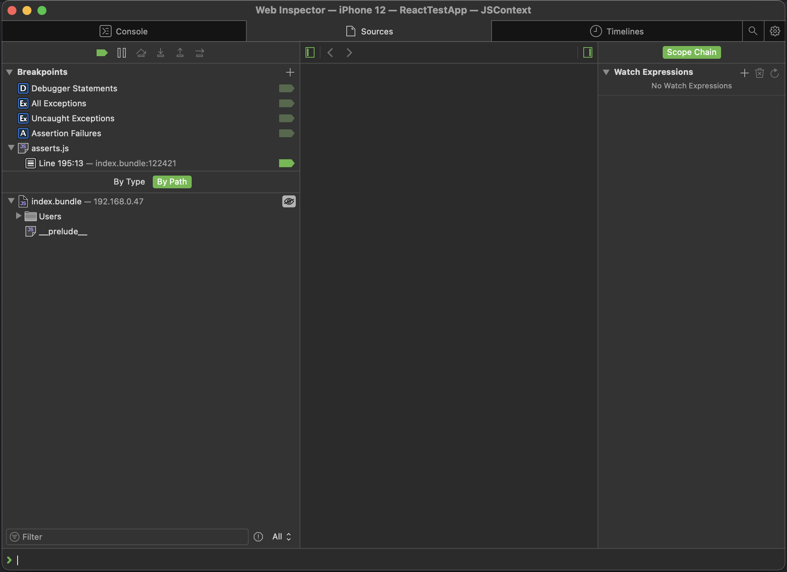
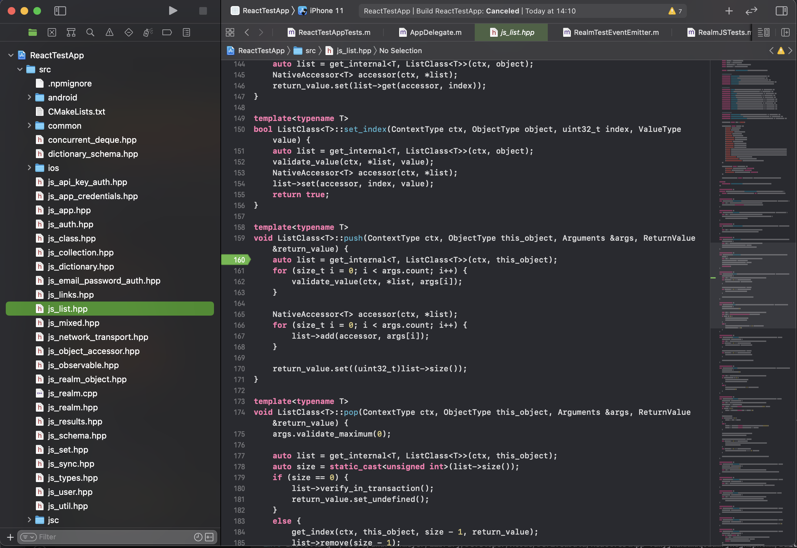

# React Native Debugging

## Preface

When developing Realm, there are times where the node tests and debugging methods are not enough.  If you have tests failing in React Native, you will need a way to set breakpoints in both the JS and C++ code.  This document will explain how to make that happen.  Note: this is currently only testing iOS in the simulator.

## Preparation and Assumptions
It is assumed the developer has their machine prepared to build realm and react-native projects.  Refer to [building.md](./building.md) if that is not the case.

The instructions below also assume that the developer is working on a MacOS system and have Xcode installed.

In your realm-js project, run the following commands to prepare for debug mode:
```sh
# install js dependencies, but skip building the node binaries
npm install --ignore-scripts
```

When running `pod install` for iOS, be sure to set the environment variable `REALM_BUILD_CORE=1`.  This will flag core to be built from source with the Debug configuration.

```sh
REALM_BUILD_CORE=1 npx pod-install
```

You are now prepared to either use the [ReactTestApp](#setup-reacttestapp) or [prepare a custom project](#setup-custom-react-native-project)

## Setup ReactTestApp

There is a test application in `tests/ReactTestApp` which will run all the unit tests living in `tests/js`.  This is a good place to start.  It is already setup to debug the JS code and the C++ source is included by reference in the Xcode project.  However this will require some steps before it is ready to run.

```sh
# install the js test dependencies
cd tests
npm install

# install the test app dependencies and copy realm and realm tests into node_modules using `install-local`
cd ReactTestApp
npm install
npx install-local
npx pod-install

# open the project in xcode
open ios/ReactTestApp.xcworkspace
```

You should now be able to move onto
- [Debugging Javascript](#debugging-javascript)
- [Debugging C++](#debugging-c++)

## Setup Custom React Native Project

### Prepare Javascript Debugging
In order to view JavaScript in Safari, it is required to make a small change to your projects AppDelegate.m.

```objective-c
- (NSURL *)sourceURLForBridge:(RCTBridge *)bridge
{
#if DEBUG
  // This is the original return from React Native
  //return [[RCTBundleURLProvider sharedSettings] jsBundleURLForBundleRoot:@"index" fallbackResource:nil];

  // This return allows for debugging the JavaScript in Safari
  return [NSURL URLWithString:[[[[RCTBundleURLProvider sharedSettings] jsBundleURLForBundleRoot:@"index" fallbackResource:nil] absoluteString] stringByAppendingString:@"&inlineSourceMap=true" ]];
#else
  return [[NSBundle mainBundle] URLForResource:@"main" withExtension:@"jsbundle"];
#endif
}
```

Once this is done, it is possible to [debug javascript](#debugging-javascript) in Safari.

### Prepare C++ Debugging
To prepare for C++ debugging, right click on your project in xcode and select "Add Files to 'projectname'...".  In the dialog, find the `src` folder in your `realm-js` project. Make sure that all targets are deselected, "Copy items if needed" is deselected and "Create folder refernces" is selected.



The project is now prepared to [debug C++](#dubugging-c++).

### Reference realm-js Project

The easiest way to get the checked out realm-js project into the React Native project is to invoke:
```
$ node ./scripts/watch-from-dependency.js -p <Path To ReactNative App>
```

This will copy the project into the node_modules folder and monitor for changes.

###
## Debugging JavaScript

The project should now be prepared to debug JavaScript.  Safari will be needed to do this. The first step is to activate the Develop menu item:



Now start running the app in the iOS simulator, either from Xcode or the command line.  When the app is started, click the Develop menu item in Safari, highlight the running simulator name and click JSContext.  Selecting "Automatically Show Web Inspector for JSContexts" will make sure the inspector is shown after reloads to the app.



In the inspector select the Sources tab.  The index.bundle can now be expanded to view the source directories.  Find the desired JS file and set some breakpoints to debug.




<b>NOTE</b>: if, in the process of this guide, the JavaScript source files are not visible, it may be necessary to download and use [Safari Technology Preview](https://developer.apple.com/safari/technology-preview/) instead.

## Debugging C++

The project should now be prepared to set breakpoints in C++.  In Xcode, open the `src` folder, which should be visible in the project workspace.  Find the desired C++ file and set some breakpoints to debug.



## References

[Debugging React Native iOS apps with Safari](http://blog.nparashuram.com/2019/10/debugging-react-native-ios-apps-with.html)
