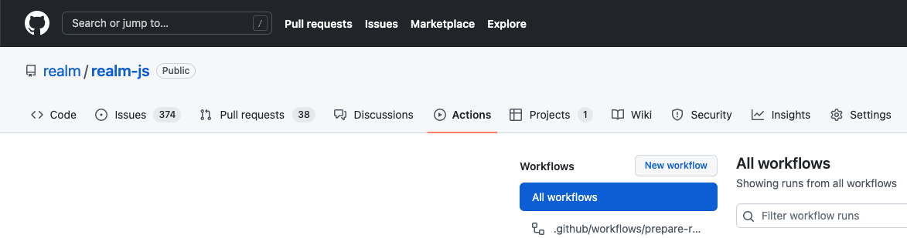

# Working with Github Actions

We are using [Github Actions](https://github.com/features/actions) to automate building, testing and releasing.

You find the workflows in the "Actions" menu.

## Delete apps and clusters

In most cases our test suites will delete Atlas clusters and apps but not always. If you need to delete them manually, you can use the workflow "Wipe all clusters and apps". The workflow does not distinguish between "active" and "leftover" apps so it can lead to currently running tests to fail.

TEST
