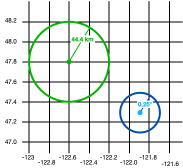
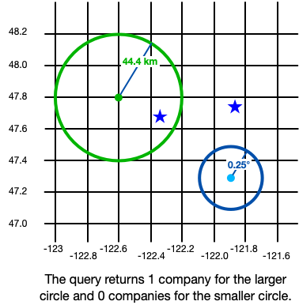
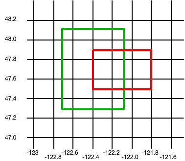
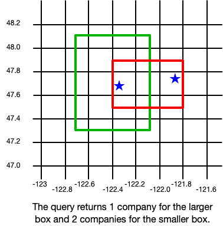
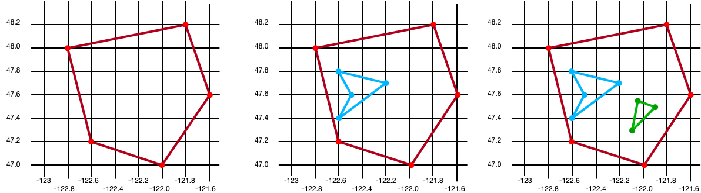
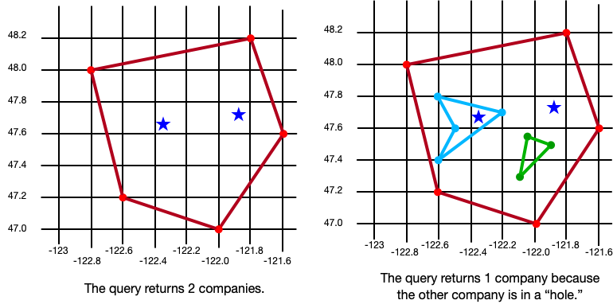
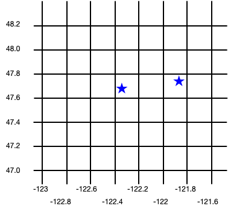

# Geospatial - React Native SDK
> Version added: 12.0.0

Geospatial data, or "geodata", specifies points and geometric objects on the Earth's
surface. With the geodata types, you can create queries that check whether a given
point is contained within a shape. For example, you can find all coffee shops within
15km of a specified point.

## Geospatial Data Types
The SDK supports geospatial queries using the following data types:

- GeoPoint
- GeoCircle
- GeoBox
- GeoPolygon

The SDK provides these geospatial data types to simplify querying geospatial data. You *cannot* persist these data types directly.

For information on how to persist geospatial data, refer to the
Persist Geospatial Data section on this page.

To query against geospatial data, you can use the `geoWithin` operator
with RQL. The `geoWithin` operator takes the `coordinates`
property of an embedded object that defines the point we're querying, and
one of the geospatial shapes to check if that point is contained within
the shape.

> **NOTE:**
> The format for querying geospatial data is the same, regardless of the
shape of the geodata region.
>

### GeoPoint
A `GeoPoint` defines a specific
location on the Earth's surface. All of the geospatial data types use `GeoPoints`
to define their location.

`GeoPoint` can be one of three types:

- An object with: `latitude`: a number value`longitude`: a number value`altitude`: an optional number value
- `CanonicalGeoPoint`:  an interface that satisfies the GeoJSON specifications for a point
- `GeoPosition`: an array with longitude, latitude, and an optional altitude

A GeoPoint is used only as a building block of the other shapes:
GeoCircle, GeoBox, and GeoPolygon. These shapes, and the GeoPoint type,
are used in queries, not for persistence.

To save geospatial data to realm, refer to Persist Geospatial Data on this page.

### GeoCircle
A `GeoCircle` defines a circle on
the Earth's surface. You define a `GeoCircle` by providing:

- A `GeoPoint` for the center of the circle
- A number for the distance (radius) of the circle

The radius distance uses radians as the unit of measure. The SDK
provides the methods `kmToRadians` and `miToRadians` to convert
kilometers or miles to radians.

The following code shows two examples of creating a circle:

```typescript
import React from 'react';
import {View, Text} from 'react-native';
import {GeoCircle, GeoPoint, kmToRadians} from 'realm';
import {useQuery} from '@realm/react';

function Geocircle(): JSX.Element {
  // Define a GeoCircle
  const smallCircle: GeoCircle = {
    center: [-121.9, 47.3],
    // The GeoCircle radius is measured in radians.
    // This radian distance corresponds with 0.25 degrees.
    distance: 0.004363323,
  };

  // Realm provides `kmToRadians` and `miToRadians`
  // to convert these measurements. Import the relevant
  // convenience method for your app's needs.
  const radiusFromKm = kmToRadians(44.4);

  // Define a GeoPoint within a GeoCircle
  const largeCircleCenter: GeoPoint = {
    longitude: -122.6,
    latitude: 47.8,
  };

  const largeCircle: GeoCircle = {
    center: largeCircleCenter,
    distance: radiusFromKm,
  };

  // Query geospatial data
  const companiesInSmallCircle = useQuery(
    Company,
    collection => collection.filtered('location geoWithin $0', smallCircle),
    [smallCircle],
  );

  // Query geospatial data
  const companiesInLargeCircle = useQuery(
    Company,
    collection => collection.filtered('location geoWithin $0', largeCircle),
    [largeCircle],
  );

  return (
    <View>
      <Text>Small circle: {companiesInSmallCircle.length}</Text>
      <Text>Large circle: {companiesInLargeCircle.length}</Text>
    </View>
  );
}
```

The following image shows the results of creating two objects: a small circle
and a large circle.



Queries against geospatial data return realm objects within the shapes you
define. From the example above, this is the result of our queries:



### GeoBox
A `GeoBox` defines a rectangle on
the Earth's surface. You define the rectangle by specifying the bottom left
(southwest) corner and the top right (northeast) corner. A GeoBox behaves
in the same way as the corresponding GeoPolygon.

The following example creates 2 boxes:

```typescript
import React from 'react';
import {View, Text} from 'react-native';
import {GeoBox, GeoPoint} from 'realm';
import {useQuery} from '@realm/react';

function Geobox(): JSX.Element {
  // Define a GeoBox
  const largeBox: GeoBox = {
    bottomLeft: [-122.7, 47.3],
    topRight: [-122.1, 48.1],
  };

  // Define GeoBox corners
  const smallBoxBottomLeft: GeoPoint = {
    longitude: -122.4,
    latitude: 47.5,
  };
  const smallBoxTopRight: GeoPoint = {
    longitude: -121.8,
    latitude: 47.9,
  };
  const smallBox: GeoBox = {
    bottomLeft: smallBoxBottomLeft,
    topRight: smallBoxTopRight,
  };

  // Query geospatial data
  const companiesInLargeBox = useQuery(
    Company,
    collection => collection.filtered('location geoWithin $0', largeBox),
    [largeBox],
  );

  // Query geospatial data
  const companiesInSmallBox = useQuery(
    Company,
    collection => collection.filtered('location geoWithin $0', smallBox),
    [smallBox],
  );

  return (
    <View>
      <Text>Small box: {companiesInSmallBox.length}</Text>
      <Text>Large box: {companiesInLargeBox.length}</Text>
    </View>
  );
}
```

The following image shows the results of creating two objects: a small box
and a large box.



Queries against geospatial data return realm objects within the shapes you
define. From the example above, this is the result of our queries:



### GeoPolygon
A `GeoPolygon` defines a polygon
on the Earth's surface. Because a polygon is a closed shape, you must provide a
minimum of 4 points: 3 points to define the polygon's shape, and a fourth to
close the shape.

> **IMPORTANT:**
> The fourth point in a polygon must be the same as the first point.
>

You can also exclude areas within a polygon by defining one or more "holes". A
hole is another polygon whose bounds fit completely within the outer polygon.
The following example creates 3 polygons: one is a basic polygon with 5 points,
one is the same polygon with a single hole, and the third is the same polygon
with two holes:

```typescript
import React from 'react';
import {View, Text} from 'react-native';
import {GeoPolygon, GeoPoint} from 'realm';
import {useQuery} from '@realm/react';

function Geopolygon(): JSX.Element {
  // Define a basic GeoPolygon
  const basicPolygon: GeoPolygon = {
    outerRing: [
      [-122.8, 48.0],
      [-121.8, 48.2],
      [-121.6, 47.6],
      [-122.0, 47.0],
      [-122.6, 47.2],
      [-122.8, 48.0],
    ],
  };

  // Define a GeoPolygon with one hole
  const outerRing: GeoPoint[] = [
    [-122.8, 48.0],
    [-121.8, 48.2],
    [-121.6, 47.6],
    [-122.0, 47.0],
    [-122.6, 47.2],
    [-122.8, 48.0],
  ];

  const hole: GeoPoint[] = [
    [-122.6, 47.8],
    [-122.2, 47.7],
    [-122.6, 47.4],
    [-122.5, 47.6],
    [-122.6, 47.8],
  ];

  const polygonWithOneHole: GeoPolygon = {
    outerRing: outerRing,
    holes: [hole],
  };

  // Add a second hole to the GeoPolygon
  const hole2: GeoPoint[] = [
    {
      longitude: -122.05,
      latitude: 47.55,
    },
    {
      longitude: -121.9,
      latitude: 47.55,
    },
    {
      longitude: -122.1,
      latitude: 47.3,
    },
    {
      longitude: -122.05,
      latitude: 47.55,
    },
  ];

  const polygonWithTwoHoles: GeoPolygon = {
    outerRing: outerRing,
    holes: [hole, hole2],
  };

  // Query geospatial data
  const companiesInBasicPolygon = useQuery(
    Company,
    collection => collection.filtered('location geoWithin $0', basicPolygon),
    [basicPolygon],
  );

  // Query geospatial data
  const companiesInPolygonWithTwoHoles = useQuery(
    Company,
    collection =>
      collection.filtered('location geoWithin $0', polygonWithTwoHoles),
    [polygonWithTwoHoles],
  );

  return (
    <View>
      <Text>Basic polygon: {companiesInBasicPolygon.length}</Text>
      <Text>
        Polygon with two holes: {companiesInPolygonWithTwoHoles.length}
      </Text>
    </View>
  );
}
```

The following image shows the results of creating three objects: a polygon,
a polygon with one hole, and a polygon with two holes.



Queries against geospatial data return realm objects within the shapes you
define. From the example above, this is the result of our queries:



## Persist Geospatial Data
> **IMPORTANT:**
> Currently, you can only persist geospatial data. Geospatial data types *cannot* be persisted directly. For example, you
can't declare a property that is of type `GeoBox`.
>
> These types can only be used as arguments for geospatial queries.
>

If you want to persist geospatial data, it must conform to the
[GeoJSON spec](https://datatracker.ietf.org/doc/html/rfc7946).

### Create a GeoJSON-Compatible Class
To create a class that conforms to the GeoJSON spec, you:

1. Create an embedded realm object. For more information about embedded
objects, refer to Embedded Objects - React Native SDK.
2. At a minimum, add the two fields required by the GeoJSON spec: A field of type `double[]` that maps to a "coordinates" (case sensitive)
property in the realm schema.A field of type `string` that maps to a "type" property. The value of this
field must be "Point".

To simplify geodata persistence, you can define a model that implements
`CanonicalGeoPoint`, which already has the correct shape. The following
example shows an embedded class named `MyGeoPoint` that is used
to persist geospatial data.

You then use the custom `MyGeoPoint` class in your realm model, as shown in the
following example. You add instances of your class to the realm just like any other Realm
model. However, in this example, because the `MyGeoPoint` class does not
extend `Realm.Object`, we must specify `MyGeoPoint.schema` when opening
the realm:

```typescript
import React from 'react';
import Realm, {ObjectSchema, CanonicalGeoPoint, GeoPosition} from 'realm';
import {RealmProvider} from '@realm/react';

// Implement `CanonicalGeoPoint`
// for convenience when persisting geodata.
class MyGeoPoint implements CanonicalGeoPoint {
  coordinates!: GeoPosition;
  type = 'Point' as const;

  constructor(long: number, lat: number) {
    this.coordinates = [long, lat];
  }

  static schema: ObjectSchema = {
    name: 'MyGeoPoint',
    embedded: true,
    properties: {
      type: 'string',
      coordinates: 'double[]',
    },
  };
}

class Company extends Realm.Object<Company> {
  _id!: number;
  location!: MyGeoPoint;

  static schema: ObjectSchema = {
    name: 'Company',
    properties: {
      _id: 'int',
      location: 'MyGeoPoint',
    },
    primaryKey: '_id',
  };
}

export const Geospatial = () => {
  return (
    <View>
      {/*
          `MyGeoPoint` does not extend `Realm.Object`, so you pass
          only the `.schema` when opening the realm.
      */}
      <RealmProvider schema={[Company, MyGeoPoint.schema]}>
        <WriteGeospatialObjects />
      </RealmProvider>
    </View>
  );
};
```

### Write the Embedded Class
Within `RealmProvider`, create your geospatial objects by combining the
embedded class with classes that extend `Realm.Object`.

```typescript
import React from 'react';
import {View} from 'react-native';
import {useEffect} from 'react';
import {useRealm, useQuery} from '@realm/react';

function WriteGeospatialObjects(): JSX.Element {
  const realm = useRealm();
  const companies = useQuery(Company);

  useEffect(() => {
    if (!companies.length) {
      // Add geospatial objects to realm.
      writeNewCompany({_id: 6, location: new MyGeoPoint(-122.35, 47.68)});
      writeNewCompany({_id: 9, location: new MyGeoPoint(-121.85, 47.9)});
    }
  }, []);

  type CompanyProps = {
    _id: number;
    location: MyGeoPoint;
  };

  const writeNewCompany = ({_id, location}: CompanyProps) => {
    // Add geospatial object to realm.
    realm.write(() => {
      realm.create(Company, {
        _id,
        location,
      });
    });
  };

  return (
    <View>
      <Geocircle />
      <Geobox />
      <Geopolygon />
    </View>
  );
}
```

The following image shows the results of creating these two company objects.


