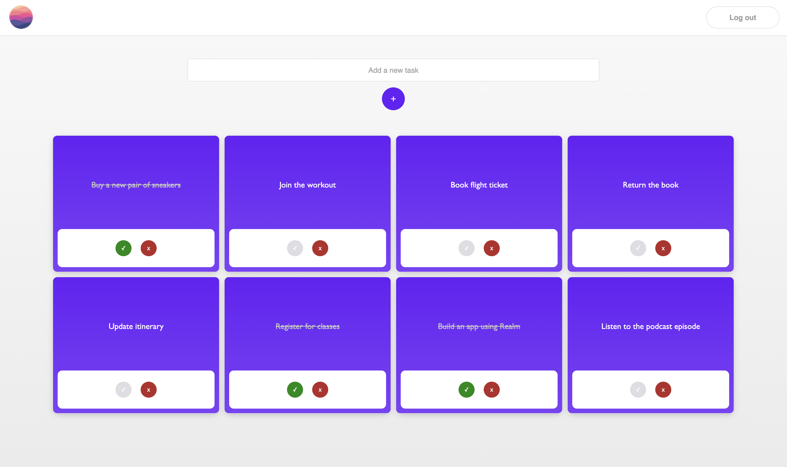

# Example React App Using Realm & Sync for Web

This is an example React Todo/Task app for showcasing Realm and Sync for Web.

## MongoDB & Realm Functionality

### Use cases

* Log in and register (email/password)
* Log out
* Create tasks
* Read/query tasks
* Update the status of tasks
* Delete tasks
* Sync
  1. Tasks are stored locally in an in-memory realm..
  2. then synced to MongoDB Atlas..
  3. then synced to all other apps connected to the same Atlas App.
* Offline-first
  * All CRUD functionality works while offline.
* Realm JS and [@realm/react](https://www.npmjs.com/package/@realm/react) hooks

### Screenshot



## Getting Started

### Prerequisites

* Emscripten v3.1.40 or later.
  * Follow the [recommended installation instructions](https://emscripten.org/docs/getting_started/downloads.html#installation-instructions-using-the-emsdk-recommended).
  * (In particular, do not use v3.1.39)
* [Node.js](https://nodejs.org/en) v16 or later

### Installation

Clone the repository and the current branch, then navigate to the project directory:

```sh
cd realm-js
```

Install dependencies and packages:

```sh
git submodule update --init --recursive
npm i
```

### Setting up an Atlas App and Device Sync

To sync Realm data you must first:

1. [Create an App Services App](https://www.mongodb.com/docs/atlas/app-services/manage-apps/create/create-with-ui/)
2. [Enable Email/Password Authentication](https://www.mongodb.com/docs/atlas/app-services/authentication/email-password/#std-label-email-password-authentication)
    * For development purposes, you can also automatically confirm users:
      * In the App Services UI, go to the **Authentication** tab > **Authentication Providers** > Edit **Email/Password** > **User Confirmation Method**
3. [Enable Flexible Sync](https://www.mongodb.com/docs/atlas/app-services/sync/configure/enable-sync/) with **Development Mode** on.
    * When Development Mode is enabled, queryable fields will be added automatically.
    * Queryable fields used in this app: `_id`, `isComplete`
4. Select a **global** [deployment region](https://www.mongodb.com/docs/atlas/app-services/apps/deployment-models-and-regions/#deployment-models---regions):
    * In the App Services UI, go to the **App Settings** tab > **General** > **Deployment Region**
5. Allow client requests from all or specific IP addresses:
    * In the App Services UI, go to the **App Settings** tab > **IP Access List** > **Add IP Address**
6. [Set read/write permissions](https://www.mongodb.com/docs/atlas/app-services/rules/roles/#with-device-sync) for the collection.
    * This app assumes all users can read and write all tasks in the collection.
    * In the App Services UI, go to the **Rules** tab > Click on the **Task** collection > Add a `readAndWriteAll` role.
    * *You may need to run the client before seeing the **Task** collection.*

Once done, [copy your App ID](https://www.mongodb.com/docs/atlas/app-services/reference/find-your-project-or-app-id/#std-label-find-your-app-id) from the App Services UI and paste it as the value of `ATLAS_APP_ID` in [src/atlas-app-services/config.json](./src/atlas-app-services/config.json):

```json
{
  "ATLAS_APP_ID": "YOUR_ID"
}
```

### Building the App

Build the app (the output will be located in the `build` folder and is minified):

```sh
npm run build
```

### Running the App

Start the app in the development mode:

```sh
npm start
```

This should automatically open your default browser; but if not, open [http://localhost:3000](http://localhost:3000).

The page will reload if you make edits to the code. (Changes made to code in dependencies such as `realm` or `@realm/react` requires a rebuild.)

### Troubleshooting

A great way to troubleshoot sync-related errors is to read the [logs in the App Services UI](https://www.mongodb.com/docs/atlas/app-services/logs/logs-ui/).
