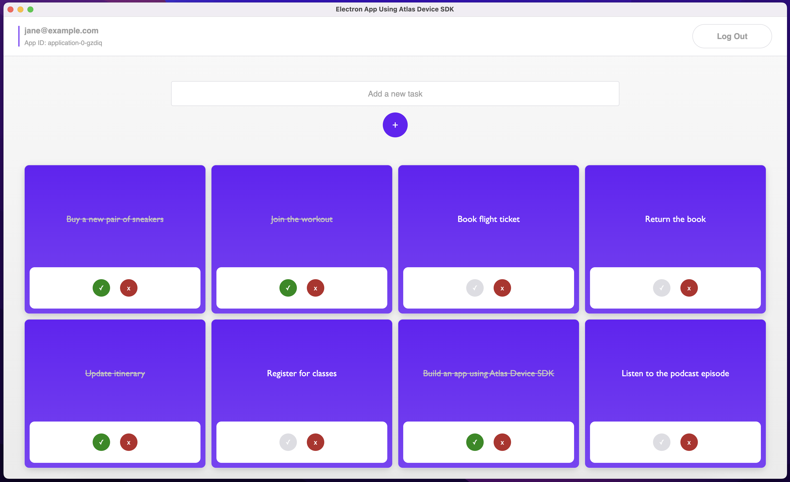

# An Offline-First Todo List App Using Atlas Device SDK for Electron

A todo list (task manager) app showcasing how to create, read, update, and delete data while offline using [MongoDB's Atlas Device SDK for Electron](https://www.mongodb.com/docs/realm/sdk/node/integrations/electron-cra/) (fka Realm).

> **TIP:** This app can be run together with the corresponding [React Native example app](../rn-todo-list/) using the same [App Services App](./backend/).

## Screenshots



## Project Structure

The following shows the project structure and the most relevant files.

> To learn more about the backend file structure, see [App Configuration](https://www.mongodb.com/docs/atlas/app-services/reference/config/).

```
├── backend                             - App Services App
│   └── (see link above)
│
├── frontend                            - Electron App
│   ├── public
│   │   ├── electron.cjs                - Creates the browser window
│   │   └── index.html                  - File served to client
│   │
│   ├── src
│   │   ├── main                        - The main process
│   │   │   └── index.js
│   │   │
│   │   ├── render                      - The rendering process
│   │   │   ├── atlas-app-services
│   │   │   │   └── config.json         - Set Atlas App ID
│   │   │   │
│   │   │   ├── components
│   │   │   │   ├── AddTaskForm.tsx     - Creates a task
│   │   │   │   ├── NavBar.tsx          - Provides logout option
│   │   │   │   ├── TaskItem.tsx        - Updates or deletes a task
│   │   │   │   └── TaskList.tsx        - Displays all tasks
│   │   │   │
│   │   │   ├── hooks
│   │   │   │   └── useTaskManager.ts   - Functions for managing (CRUD) tasks
│   │   │   │
│   │   │   ├── models
│   │   │   │   └── Task.ts             - Data model
│   │   │   │
│   │   │   ├── pages
│   │   │   │   ├── LoginPage.tsx       - Login and registration
│   │   │   │   └── TaskPage.tsx        - Task page with sync-related ops
│   │   │   │
│   │   │   ├── App.tsx                 - Get and provide Atlas App
│   │   │   └── AuthenticatedApp.tsx    - Open and provide Realm & User
│   │   │ 
│   │   └── index.tsx                   - Entry point
│   │
│   ├── craco.config.cjs                - The bundler config for the rendering process
│   └── package.json                    - Dependencies
│
└── README.md                           - Instructions and info
```

## Use Cases

This app focuses on showing how to work with data no matter the network connection.

It specifically addresses the following points:

* Registering and logging in to an App Services App using [Email/Password Authentication](https://www.mongodb.com/docs/atlas/app-services/authentication/email-password/).
* Accessing and updating data:
  * Create
  * Query/Read
    * Sort and filter the query
  * Update
  * Delete
* Using offline/local-first reads and writes.
  * Shows configuration for opening a synced Realm.
    * Realms are opened immediately without waiting for downloads from the server.
    * See [Offline Support](#note-offline-support) below.
* Allowing users to only read and write to their own tasks via [data access rules/permissions](https://www.mongodb.com/docs/atlas/app-services/rules/roles/#define-roles---permissions).
  * See [Set Data Access Permissions](#set-data-access-permissions) further below.

### Note: Offline Support

Users who have logged in at least once will have their credentials cached on the client. Thus, a logged in user who restarts the app will remain logged in. [@realm/react's](https://www.npmjs.com/package/@realm/react) `UserProvider` automatically handles this for you by checking if the `app.currentUser` already exists.

Data that was previously synced to the device will also exist locally in the Realm database. From this point on, users can be offline and still query and update data. Any changes made offline will be synced automatically to Atlas and any other devices once a network connection is established. If multiple users modify the same data either while online or offline, those conflicts are [automatically resolved](https://www.mongodb.com/docs/atlas/app-services/sync/details/conflict-resolution/) before being synced.

#### Realm Configuration

When [opening a Realm](https://www.mongodb.com/docs/realm/sdk/react-native/sync-data/configure-a-synced-realm/), we can specify the behavior in the Realm configuration when opening it for the first time (via `newRealmFileBehavior`) and for subsequent ones (via `existingRealmFileBehavior`). We can either:
* `OpenRealmBehaviorType.OpenImmediately`
  * Opens the Realm file immediately if it exists, otherwise it first creates a new empty Realm file then opens it.
  * This lets users use the app with the existing data, while syncing any changes to the device in the background.
* `OpenRealmBehaviorType.DownloadBeforeOpen`
  * If there is data to be downloaded, this waits for the data to be fully synced before opening the Realm.

This app opens a Realm via `RealmProvider` (see [AuthenticatedApp.tsx](./frontend/src/renderer/AuthenticatedApp.tsx)) and passes the configuration as props. We use `OpenImmediately` for new and existing Realm files in order to use the app while offline.

> See [OpenRealmBehaviorConfiguration](https://www.mongodb.com/docs/realm-sdks/js/latest/types/OpenRealmBehaviorConfiguration.html) for possible configurations of new and existing Realm file behaviors.

## Getting Started

### Prerequisites

* [Node.js](https://nodejs.org/)

### Set up an Atlas Database

Start by [deploying a free Atlas cluster](https://www.mongodb.com/docs/atlas/getting-started/#get-started-with-atlas) and create an Atlas database.

### Set up an Atlas App Services App

You can either choose to set up your App via a CLI (this has fewer steps and is much faster since all configurations are already provided in the [backend directory](./backend/)), or via the App Services UI (steps provided below).

#### Via a CLI (recommended)

To import and deploy changes from your local directory to App Services you can use the command line interface:

1. [Set up Realm CLI](https://www.mongodb.com/docs/atlas/app-services/cli/).
2. In the provided [backend directory](./backend/) (the App Services App), update the following:
    * Cluster Name
      * Update the `"clusterName"` in [data_sources/mongodb-atlas/config.json](./backend/data_sources/mongodb-atlas/config.json) to the name of your cluster.
      * (The default name is `Cluster0`.)
    * App ID
      * There is no `"app_id"` defined in [realm_config.json](./backend/realm_config.json) since we will create a brand new App. **If** you for some reason are updating an existing app, add an `"app_id"` field and its value.
3. [Push and deploy](https://www.mongodb.com/docs/atlas/app-services/cli/realm-cli-push/#std-label-realm-cli-push) the local directory to App Services:
```sh
realm-cli push --local <path to backend directory>
```
4. Once pushed, verify that your App shows up in the App Services UI.
5. 🥳 You can now go ahead and [install dependencies and run the Electron app](#install-dependencies).

#### Via the App Services UI

To sync data used in this app you must first:

1. [Create an App Services App](https://www.mongodb.com/docs/atlas/app-services/manage-apps/create/create-with-ui/).
2. [Enable Email/Password Authentication](https://www.mongodb.com/docs/atlas/app-services/authentication/email-password/).
    * For this example app, we automatically confirm users' emails.
3. [Enable Flexible Sync](https://www.mongodb.com/docs/atlas/app-services/sync/configure/enable-sync/) with **Development Mode** enabled.
    * When Development Mode is enabled, [queryable fields](https://www.mongodb.com/docs/atlas/app-services/sync/configure/sync-settings/#queryable-fields) will be added **automatically**, and schemas will be inferred based on the client Realm data models.
    * For information, queryable fields used in this app include:
      * Global (all collections): `_id`
      * `Task` collection: `isComplete`, `userId`
    * (Development Mode should be turned off in production.)
4. Don't forget to click `Review Draft and Deploy`.

### Install Dependencies

From the [frontend directory](./frontend/), run:

```sh
npm install
```

### Run the App

1. Copy your [Atlas App ID](https://www.mongodb.com/docs/atlas/app-services/reference/find-your-project-or-app-id/#std-label-find-your-app-id) from the App Services UI.
2. Paste the copied ID as the value of the existing field `ATLAS_APP_ID` in [src/renderer/atlas-app-services/config.json](./frontend/src/renderer/atlas-app-services/config.json):
```js
{
  "ATLAS_APP_ID": "YOUR_APP_ID"
}
```
3. Build the application:
```sh
npm run build
```
4. Start Electron:
```sh
npm start
```

### Set Data Access Permissions

> If you set up your App Services App [via a CLI](#via-a-cli-recommended), you can **skip this step** as the permissions should already be defined for you.

After running the client app for the first time, [modify the rules](https://www.mongodb.com/docs/atlas/app-services/rules/roles/#define-roles---permissions) for the collection in the App Services UI.

* Collection: `Task`
  * Permissions: `readOwnWriteOwn` (see [corresponding json](./backend/data_sources/mongodb-atlas/TodoList/Task/rules.json))
  * Explanation:
    * A user should be able to read and write to their own document (i.e. when `Task.userId === <App User ID>`), but not anyone else's.

> To learn more and see examples of permissions depending on a certain use case, see [Device Sync Permissions Guide](https://www.mongodb.com/docs/atlas/app-services/sync/app-builder/device-sync-permissions-guide/#std-label-flexible-sync-permissions-guide) and [Data Access Role Examples](https://www.mongodb.com/docs/atlas/app-services/rules/examples/).

## Troubleshooting

A great help when troubleshooting is to look at the [Application Logs](https://www.mongodb.com/docs/atlas/app-services/activity/view-logs/) in the App Services UI.

### Permissions

If permission is denied:
  * Make sure your IP address is on the [IP Access List](https://www.mongodb.com/docs/atlas/app-services/security/network/#ip-access-list) for your App.
  * Make sure you have the correct data access permissions for the collections.
    * See [Set Data Access Permissions](#set-data-access-permissions) further above.

### Removing the Local Realm Database

Removing the local database can be useful for certain errors. When running the app, the local database will exist in the directory `mongodb-realm/`.

From the [frontend directory](./frontend/), run:

```sh
npm run rm-local-db
```
