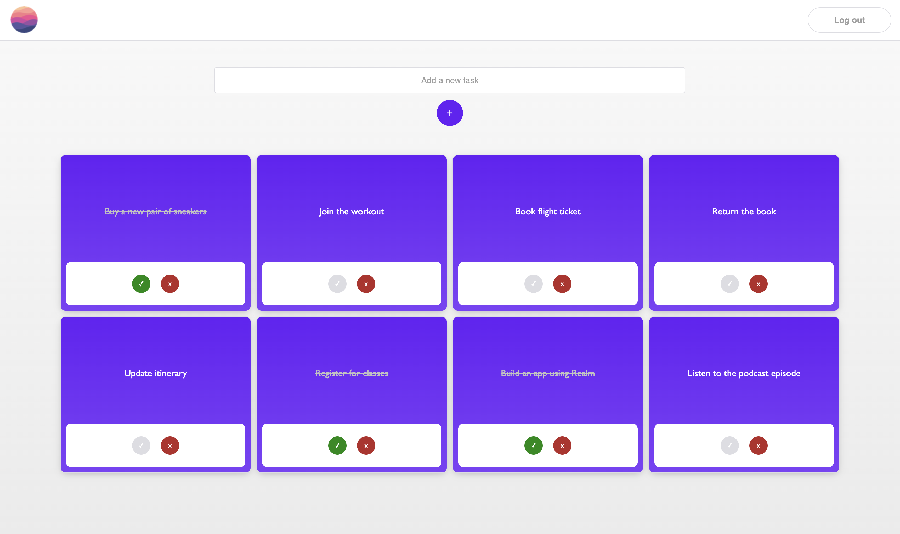

# Electron Example

This Electron example shows how to use Device Sync and `@ream/react` in an Electron application.

## Screenshots



## Project Structure

The following shows the project structure and the most relevant files.

```
├── src
│   ├── main - The main process
│   │   └── index.js
│   └── render              - The rendering process
│      ├── atlas-app-services
│      |   └── config.json - The config for the AppID
│      ├── components      - React components for the app
│      ├── hooks           - Custom hooks needed for the app
│      ├── models          - The local database models
│      ├── pages           - Routes for the application
│      ├── styles          - All stylings contained here
│      ├── App.tsx         - Main app entry point
│      └── AuthenticatedApp.tsx  - App after auth established
├── public              - The folder of static contents to the web app
│   └── electron.js     - The bootstrap script for electron
└── craco.config.cjs    - The bundler config for the rendering process
```
### Realm Details

* RealmJS version: ^12.1.0
* Device Sync type: [Flexible](https://www.mongodb.com/docs/atlas/app-services/sync/configure/enable-sync/)

## Getting Started

### Prerequisites

* [Node.js](https://nodejs.org/)

### Set Up an Atlas App Services App

To sync data used in this app you must first:

1. [Create an App Services App](https://www.mongodb.com/docs/atlas/app-services/manage-apps/create/create-with-ui/)
2. Enable [Email/Password Authentication](https://www.mongodb.com/docs/atlas/app-services/authentication/email-password/#std-label-email-password-authentication)
    * For this example app, we automatically confirm users' emails.
3. [Enable Flexible Sync](https://www.mongodb.com/docs/atlas/app-services/sync/configure/enable-sync/) with **Development Mode** on.
    * When Development Mode is enabled, [queryable fields](https://www.mongodb.com/docs/atlas/app-services/sync/configure/sync-settings/#queryable-fields) will be added **automatically**, and schemas will be inferred based on the client Realm data models.

After running the client and seeing the available collections in Atlas, [set read/write permissions](https://www.mongodb.com/docs/atlas/app-services/rules/roles/#define-roles---permissions) for all collections.

### Install Dependencies

```sh
npm install
```

### Run the App

1. Copy your [Atlas App ID](https://www.mongodb.com/docs/atlas/app-services/reference/find-your-project-or-app-id/#std-label-find-your-app-id) from the App Services UI.
2. Paste the copied ID as the value of the existing variable `ATLAS_APP_ID` in [src/renderer/atlas-app-services/config.json](./src/renderer/atlas-app-services/config.ts):
```js
{
  "ATLAS_APP_ID": "YOUR_APP_ID"
}
```

3. Build the application

```sh
npm run build
```

4. Start electron

```sh
npm start
```
