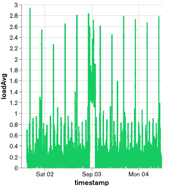

# Telemetry demo app using Data Ingest and Atlas Charts

A [Node.js](https://nodejs.org) application to demonstrate how to use [Atlas Device Sync](https://www.mongodb.com/atlas/app-services/device-sync) and the [Realm Node.js SDK](https://www.mongodb.com/docs/realm/sdk/node/) to read sensor data, store the data in [Atlas](https://www.mongodb.com/atlas), and visualize it with [Atlas Charts](https://www.mongodb.com/products/charts). [Data Ingest](https://www.mongodb.com/docs/atlas/app-services/sync/configure/sync-settings/#data-ingest) is enabled since this app uses insert-only workloads.

## Project Structure

The following shows the project structure and the most relevant files.

```
├── src
│   ├── models
│   │   ├── machine_info.ts
│   │   └── sensor_reading.ts
│   ├── app.ts
│   └── config.ts
├── package.json
└── README.md
```

* `src/app.ts` - the actual application
* `src/config.ts` - contains the configuration (Atlas App ID)
* `src/models/` - the model classes

## Use Cases

This app focuses on showing how to use Data Ingest for heavy client-side insert-only workloads. It specifically addresses the following points:

* Using the [Data Ingest](https://www.mongodb.com/docs/atlas/app-services/sync/configure/sync-settings/#data-ingest) sync strategy via asymmetric Realm objects.
* Reading sensor data (system load averages, uptime, and free memory).
* Inserting sensor data every few seconds and syncing it to [Atlas](https://www.mongodb.com/atlas).
* (The data in Atlas can be visualized via [Atlas Charts](https://www.mongodb.com/products/charts), but since this is a Node.js app, the visualization is not shown.)

### Realm Details

* [Realm JavaScript](https://github.com/realm/realm-js) version: ^12.1.0
* Device Sync type: [Flexible](https://www.mongodb.com/docs/realm/sdk/node/sync/flexible-sync/) with [Data Ingest](https://www.mongodb.com/docs/atlas/app-services/sync/configure/sync-settings/#data-ingest)

## Getting Started

### Prerequisites

* [Node.js](https://nodejs.org/)
* An [Atlas App Service](https://www.mongodb.com/docs/atlas/app-services/) account

### Set Up an Atlas App Services App

To sync Realm data you must first:

1. [Create an App Services App](https://www.mongodb.com/docs/atlas/app-services/manage-apps/create/create-with-ui/)
2. [Enable Anonymous Authentication](https://www.mongodb.com/docs/atlas/app-services/authentication/anonymous/)
3. [Enable Flexible Sync](https://www.mongodb.com/docs/atlas/app-services/sync/configure/enable-sync/) with **[Development Mode](https://www.mongodb.com/docs/atlas/app-services/sync/configure/sync-settings/#development-mode)** on.

After running the client and seeing the available collection in Atlas, [set write permissions](https://www.mongodb.com/docs/atlas/app-services/rules/roles/#define-roles---permissions) for the collection.

The following schema will automatically be created in **Development Mode** and you can find it at `App Services / Data Access / Schema` in the Atlas App Service UI:

```json
{
  "title": "SensorReading",
  "type": "object",
  "required": [
    "_id",
    "freemem",
    "timestamp",
    "uptime"
  ],
  "properties": {
    "_id": {
      "bsonType": "objectId"
    },
    "freemem": {
      "bsonType": "long"
    },
    "loadAvg": {
      "bsonType": "array",
      "items": {
        "bsonType": "float"
      }
    },
    "machineInfo": {
      "title": "MachineInfo",
      "type": "object",
      "required": [
        "platform",
        "release"
      ],
      "properties": {
        "platform": {
          "bsonType": "string"
        },
        "release": {
          "bsonType": "string"
        }
      }
    },
    "timestamp": {
      "bsonType": "date"
    },
    "uptime": {
      "bsonType": "float"
    }
  }
}
```

### Visualize Data

Data can be visualized by [Charts](https://www.mongodb.com/products/charts). An example from a [dashboard](Charts/Dashboard.charts) is shown below.



## How to build and run

You need to clone Realm JavaScript's git repository:

```sh
git clone https://github.com/realm/realm-js
```

Moreover, you need to install the dependencies for this app:

```sh
cd realm-js/examples/example-node-telemetry
npm install
```

Before building the app, you need to add your app id to `src/config.ts`. After that, you can build and run the app:

```sh
npm start
```

You can enable debug messages:

```sh
DEBUG=realm:telemetry node dist/app.js # only debug messages for the app
DEBUG=realm:* node dist/app.js         # debug messages for many Realm operations - WARNING: much output
```
