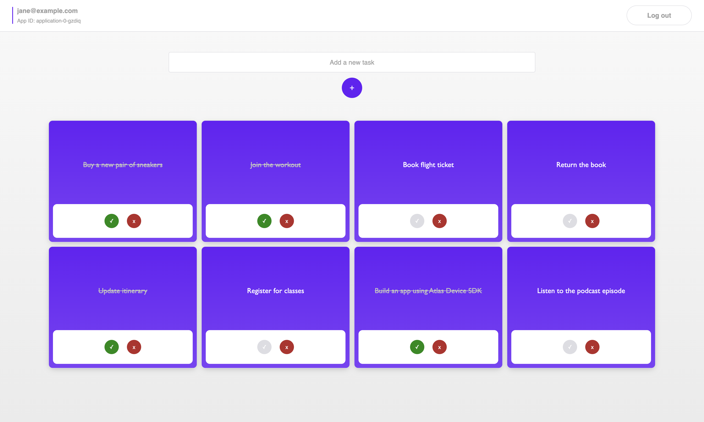

# An Offline-First Todo List App Using Atlas Device SDK for Web

A todo list (task manager) app showcasing how to create, read, update, and delete data while offline using [MongoDB's Atlas Device SDK for Web](https://www.mongodb.com/docs/realm/web/sync/) (fka Realm).

> **TIP:** This app can be run together with the corresponding [Electron example app](https://github.com/realm/realm-js/tree/main/examples/electron-todo-list) and [React Native example app](https://github.com/realm/realm-js/tree/main/examples/rn-todo-list) using the same backend [App Services App](https://github.com/realm/realm-js/tree/main/examples/electron-todo-list/backend).

### Screenshot



## Project Structure

The following shows the project structure and the most relevant files.

```
├── public
│   └── index.html              - File served to client
│
├── src
│   ├── atlas-app-services
│   │   └── config.json         - Set Atlas App ID
│   │
│   ├── components
│   │   ├── AddTaskForm.tsx     - Creates a task
│   │   ├── NavBar.tsx          - Provides logout option
│   │   ├── TaskItem.tsx        - Updates or deletes a task
│   │   └── TaskList.tsx        - Displays all tasks
│   │
│   ├── hooks
│   │   └── useTaskManager.ts   - Functions for managing (CRUD) tasks
│   │
│   ├── models
│   │   └── Task.ts             - Data model
│   │
│   ├── pages
│   │   ├── LoginPage.tsx       - Login and registration
│   │   └── TaskPage.tsx        - Task page with sync-related ops
│   │
│   ├── App.tsx                 - Get and provide Atlas App
│   ├── AuthenticatedApp.tsx    - Open and provide Realm & User
│   └── index.tsx               - Entry point
│
├── craco.config.ts             - Configure CRA
├── package.json                - Dependencies
└── README.md                   - Instructions and info
```

## Use Cases

This app focuses on showing how to work with data no matter the network connection.

It specifically addresses the following points:

* Registering and logging in to an App Services App using [Email/Password Authentication](https://www.mongodb.com/docs/atlas/app-services/authentication/email-password/).
* Accessing and updating data:
  * Create
  * Query/Read
    * Sort and filter the query
  * Update
  * Delete
* Using offline/local-first reads and writes.
  * See [Offline Support](#note-offline-support) below.
* Device Sync
  1. Tasks are stored locally in an **in-memory** realm.
  2. They are then synced to MongoDB Atlas.
  3. They are then synced to all other apps connected to the same App Services App.
* Allowing users to only read and write to their own tasks via [data access rules/permissions](https://www.mongodb.com/docs/atlas/app-services/rules/roles/#define-roles---permissions).
  * See [Set Data Access Permissions](#set-data-access-permissions) further below.

### Note: Offline Support

Once a user has logged in, the user can go offline and still query and update data. Any changes made offline will be synced automatically to Atlas and any other devices once a network connection is established. If multiple users modify the same data either while online or offline, those conflicts are [automatically resolved](https://www.mongodb.com/docs/atlas/app-services/sync/details/conflict-resolution/) before being synced.

Since this SDK currently stores local data in an in-memory Realm, refreshing the app will cause the user to get logged out (see [Limitations](#limitations)).

## Getting Started

### Prerequisites

* [Node.js](https://nodejs.org/en)

### Set up an Atlas Database

Start by [deploying a free Atlas cluster](https://www.mongodb.com/docs/atlas/getting-started/#get-started-with-atlas) and create an Atlas database.

### Set up an Atlas App Services App

To sync data used in this app you must first:

1. [Create an App Services App](https://www.mongodb.com/docs/atlas/app-services/manage-apps/create/create-with-ui/)
2. [Enable Email/Password Authentication](https://www.mongodb.com/docs/atlas/app-services/authentication/email-password/#std-label-email-password-authentication)
    * For this example app, we automatically confirm users' emails.
3. [Enable Flexible Sync](https://www.mongodb.com/docs/atlas/app-services/sync/configure/enable-sync/) with **Development Mode** enabled.
    * When Development Mode is enabled, [queryable fields](https://www.mongodb.com/docs/atlas/app-services/sync/configure/sync-settings/#queryable-fields) will be added **automatically**, and schemas will be inferred based on the client Realm data models.
    * For information, queryable fields used in this app include:
      * Global (all collections): `_id`
      * `Task` collection: `isComplete`, `userId`
    * Don't forget to click `Review Draft and Deploy`.
    * (Development Mode should be turned off in production.)
4. Select a **global** [deployment region](https://www.mongodb.com/docs/atlas/app-services/apps/deployment-models-and-regions/#deployment-models---regions):
    * In the App Services UI, go to the **App Settings** tab > **General** > **Deployment Region**
5. Allow client requests from all or specific IP addresses:
    * In the App Services UI, go to the **App Settings** tab > **IP Access List** > **Add IP Address**

### Install Dependencies

Clone the **current branch** and navigate to the example app directory:

```sh
cd realm-js/examples/example-react-task
```

From this directory, run:

```sh
npm install
```

### Run the App

1. Copy your [Atlas App ID](https://www.mongodb.com/docs/atlas/app-services/reference/find-your-project-or-app-id/#std-label-find-your-app-id) from the App Services UI.
2. Paste the copied ID as the value of the existing field `ATLAS_APP_ID` in [src/atlas-app-services/config.json](./src/atlas-app-services/config.json):
```js
{
  "ATLAS_APP_ID": "YOUR_APP_ID"
}
```
3. Build the application:
```sh
npm run build
```
4. Start the app (this should automatically open your default browser; but if not, open [http://localhost:3000](http://localhost:3000)):
```sh
npm start
```

### Set Data Access Permissions

After running the client app for the first time, [modify the rules](https://www.mongodb.com/docs/atlas/app-services/rules/roles/#define-roles---permissions) for the collection in the App Services UI.

* Collection: `Task`
  * Permissions: `readOwnWriteOwn` (see corresponding json below).
  * Explanation:
    * A user should be able to read and write to their own document (i.e. when `Task.userId === <App User ID>`), but not anyone else's.

```json
{
  "roles": [
    {
      "name": "readOwnWriteOwn",
      "apply_when": {},
      "document_filters": {
        "write": {
          "userId": "%%user.id"
        },
        "read": {
          "userId": "%%user.id"
        }
      },
      "read": true,
      "write": true,
      "insert": true,
      "delete": true,
      "search": true
    }
  ]
}
```

> To learn more and see examples of permissions depending on a certain use case, see [Device Sync Permissions Guide](https://www.mongodb.com/docs/atlas/app-services/sync/app-builder/device-sync-permissions-guide/#std-label-flexible-sync-permissions-guide) and [Data Access Role Examples](https://www.mongodb.com/docs/atlas/app-services/rules/examples/).

## Troubleshooting

A great help when troubleshooting is to look at the [Application Logs](https://www.mongodb.com/docs/atlas/app-services/activity/view-logs/) in the App Services UI.

### Permissions

If permission is denied:
  * Make sure your IP address is on the [IP Access List](https://www.mongodb.com/docs/atlas/app-services/security/network/#ip-access-list) for your App.
  * Make sure you have the correct data access permissions for the collections.
    * See [Set Data Access Permissions](#set-data-access-permissions) further above.

## Limitations

### Persistence & WebWorkers

In the current state of the Atlas Device SDK for Web, in-memory realms are used for temporarily storing the data locally. A realm's data will be lost as soon as its last instance is closed.

It is not possible to share a realm instance across contexts such as browser tabs or WebWorker instances. Therefore, a hard refresh in the browser will clear the local data (e.g. logged in users will need to reauthenticate).

Note that the data will still be persisted in MongoDB Atlas and synced to the client once authenticated.

This app uses client-side routing to retain the local data across different routes.

### Encryption

Since realms are memory-only and not locally persisted, it is an error to provide an encryption key in the realm configuration. Sync traffic remains encrypted with HTTPS as usual.
