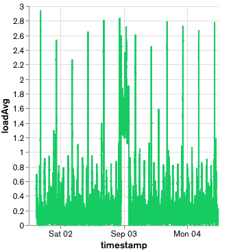

# Telemetry Demo App Using Data Ingest and Atlas Charts

A [Node.js](https://nodejs.org) application to demonstrate how to use [MongoDB's Atlas Device SDK for Node.js](https://www.mongodb.com/docs/realm/sdk/node/) (fka Realm) to read sensor data, store the data in [Atlas](https://www.mongodb.com/atlas), and visualize it with [Atlas Charts](https://www.mongodb.com/products/charts). [Data Ingest](https://www.mongodb.com/docs/atlas/app-services/sync/configure/sync-settings/#data-ingest) is enabled since this app uses insert-only workloads.

## Project Structure

The following shows the project structure and the most relevant files.

> To learn more about the backend file structure, see [App Configuration](https://www.mongodb.com/docs/atlas/app-services/reference/config/).

```
├── backend                           - App Services App
│   └── (see link above)
├── node                              - Node App
│   ├── src
│   │   ├── atlas-app-services
│   │   │   └── config.ts             - Add App ID
│   │   ├── models                    - Data model
│   │   │   ├── MachineInfo.ts
│   │   │   └── SensorReading.ts
│   │   └── app.ts                    - Entry point
│   └── package.json                  - Dependencies
└── README.md                         - Instructions and info
```

## Use Cases

This app focuses on showing how to use Data Ingest for heavy client-side insert-only workloads. It specifically addresses the following points:

* Using the [Data Ingest](https://www.mongodb.com/docs/atlas/app-services/sync/configure/sync-settings/#data-ingest) sync strategy via asymmetric Realm objects.
* Reading sensor data (system load averages, uptime, and free memory).
* Inserting sensor data every few seconds and syncing it to [Atlas](https://www.mongodb.com/atlas).
* (The data in Atlas can be visualized via [Atlas Charts](https://www.mongodb.com/products/charts), but since this is a Node.js app, the visualization is not shown.)

## Getting Started

### Prerequisites

* [Node.js](https://nodejs.org/)

### Set up an Atlas Database

Start by [deploying a free Atlas cluster](https://www.mongodb.com/docs/atlas/getting-started/#get-started-with-atlas) and create an Atlas database.

### Set up an Atlas App Services App

You can either choose to set up your App via a CLI (this has fewer steps and is much faster since all configurations are already provided in the [backend directory](./backend/)), or via the App Services UI (steps provided below).

#### Via a CLI (recommended)

To import and deploy changes from your local directory to App Services you can use the command line interface:

1. [Set up Realm CLI](https://www.mongodb.com/docs/atlas/app-services/cli/).
2. In the provided [backend directory](./backend/) (the App Services App), update the following:
    * Cluster Name
      * Update the `"clusterName"` in [data_sources/mongodb-atlas/config.json](./backend/data_sources/mongodb-atlas/config.json) to the name of your cluster.
      * (The default name is `Cluster0`.)
    * App ID
      * There is no `"app_id"` defined in [realm_config.json](./backend/realm_config.json) since we will create a brand new App. **If** you for some reason are updating an existing app, add an `"app_id"` field and its value.
3. [Push and deploy](https://www.mongodb.com/docs/atlas/app-services/cli/realm-cli-push/#std-label-realm-cli-push) the local directory to App Services:
```sh
realm-cli push --local <path to backend directory>
```
4. Once pushed, verify that your App shows up in the App Services UI.
5. 🥳 You can now go ahead and [install dependencies and run the Node app](#install-dependencies).

#### Via the App Services UI

To sync data used in this app you must first:

1. [Create an App Services App](https://www.mongodb.com/docs/atlas/app-services/manage-apps/create/create-with-ui/).
2. [Enable Anonymous Authentication](https://www.mongodb.com/docs/atlas/app-services/authentication/anonymous/).
3. [Enable Flexible Sync](https://www.mongodb.com/docs/atlas/app-services/sync/configure/enable-sync/) with **Development Mode** enabled.
    * When Development Mode is enabled, schemas and Data Ingest will be inferred based on the client Realm data models.
    * (Development Mode should be turned off in production.)
4. Don't forget to click `Review Draft and Deploy`.

### Install Dependencies

From the [node directory](./node/), run:

```sh
npm install
```

### Run the App

1. Copy your [Atlas App ID](https://www.mongodb.com/docs/atlas/app-services/reference/find-your-project-or-app-id/#std-label-find-your-app-id) from the App Services UI.
2. Paste the copied ID as the value of the existing field `config.appId` in [src/atlas-app-services/config.ts](./node/src/atlas-app-services/config.ts):
```js
const config: Config = {
  appId: "<YOUR-APP-ID>",
};
```
3. Start the script.

After running the below command, the app will start reading sensor data every few seconds. To modify the interval duration, update `INSERT_DATA_INTERVAL` in [src/app.ts](./node/src/app.ts).

```sh
npm start
```

> DEBUG mode is enabled by default when running this app via `npm start`.
> Options available:
> ```sh
> # Only debug messages for the app.
> DEBUG=realm:telemetry node dist/app.js
> 
> # Debug messages for many Realm operations.
> # - WARNING: Much output.
> DEBUG=realm:* node dist/app.js
> ```

### Set Data Access Permissions

> If you set up your App Services App [via a CLI](#via-a-cli-recommended), you can **skip this step** as the permissions should already be defined for you.

After running the client app for the first time, [check the rules](https://www.mongodb.com/docs/atlas/app-services/rules/roles/#define-roles---permissions) for the collections in the App Services UI and make sure all collections have `readAndWriteAll` permissions (see [corresponding json](./backend/data_sources/mongodb-atlas/Telemetry/SensorReading/rules.json)).

> To learn more and see examples of permissions depending on a certain use case, see [Device Sync Permissions Guide](https://www.mongodb.com/docs/atlas/app-services/sync/app-builder/device-sync-permissions-guide/#std-label-flexible-sync-permissions-guide) and [Data Access Role Examples](https://www.mongodb.com/docs/atlas/app-services/rules/examples/).


### Visualize Data

Data can be visualized by [Charts](https://www.mongodb.com/products/charts). An example from a [dashboard](./node/Charts/Dashboard.charts) is shown below.



## Troubleshooting

A great help when troubleshooting is to look at the [Application Logs](https://www.mongodb.com/docs/atlas/app-services/activity/view-logs/) in the App Services UI.

### Permissions

If permission is denied:
  * Make sure your IP address is on the [IP Access List](https://www.mongodb.com/docs/atlas/app-services/security/network/#ip-access-list) for your App.
  * Make sure you have the correct data access permissions for the collections.
    * See [Set Data Access Permissions](#set-data-access-permissions) further above.

### Removing the Local Realm Database

Removing the local database can be useful for certain errors. When running the app, the local database will exist in the directory `mongodb-realm/`.

From the [node directory](./node/), run:

```sh
npm run rm-local-db
```
