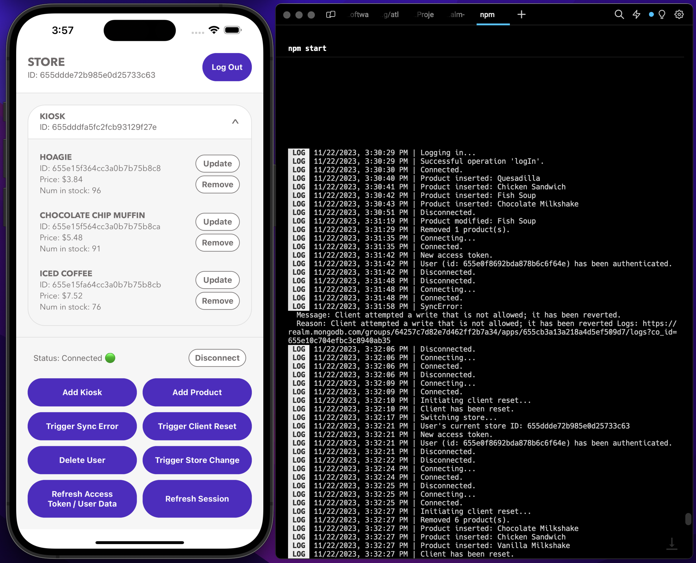

# Connection State Change & Error Handling Using Atlas Device SDK for React Native

An example app showcasing how to detect various changes in connection state, user state, sync errors, and product inventory in [MongoDB's Atlas Device SDK for React Native](https://www.mongodb.com/docs/realm/sdk/react-native/) (fka Realm).

## Screenshots




## Project Structure

The following shows the project structure and the most relevant files.

> To learn more about the backend file structure, see [App Configuration](https://www.mongodb.com/docs/atlas/app-services/reference/config/).

```
├── backend                               - App Services App
│   └── (see link above)
│
├── frontend                              - React Native App
│   ├── app
│   │   ├── atlas-app-services
│   │   │   └── config.ts                 - Add App ID
│   │   │
│   │   ├── components
│   │   │   ├── AuthResultBoundary.tsx    - Captures and logs auth result changes
│   │   │   ├── KioskItem.tsx             - Kiosk list item with products
│   │   │   └── ProductItem.tsx           - Product list item
│   │   │
│   │   ├── hooks
│   │   │   ├── useDemoSyncTriggers.ts    - Triggers for various sync listeners
│   │   │   └── useDemoAuthTriggers.ts    - Triggers for various auth listeners
│   │   │
│   │   ├── models
│   │   │   ├── Kiosk.ts                  - Simplified data models
│   │   │   ├── Product.ts
│   │   │   └── Store.ts
│   │   │
│   │   ├── providers
│   │   │   └── StoreProvider.tsx         - Queries and updates store data
│   │   │
│   │   ├── screens
│   │   │   ├── LoginScreen.tsx           - Login and registration
│   │   │   └── StoreScreen.tsx           - Shows products and triggers
│   │   │
│   │   ├── utils
│   │   │   └── logger.ts                 - Replaceable logger
│   │   │
│   │   └── App.tsx                       - Provides the App Services App and Realm
│   │
│   ├── index.js                          - Entry point
│   └── package.json                      - Dependencies
│
└── README.md                             - Instructions and info
```

## Use Cases

This app focuses on showing where and when you can (a) perform logging and (b) handle specific scenarios based on observed changes. The app itself is a store with kiosks displaying all the products in that store.

It specifically addresses the following points:

* Registering and logging in using [Email/Password Authentication](https://www.mongodb.com/docs/atlas/app-services/authentication/email-password/).
  * The following scenarios can be triggered:
    * Registering
      * Successfully
      * With invalid password
      * With email already in use
    * Logging in
      * Successfully
      * With invalid password
      * With non-existent email
* Listening (and triggering) when a user gets logged out.
* Listening (and triggering) when a user gets removed.
* Listening (and triggering) when a user's tokens are refreshed.
* Listening (and triggering) when the underlying sync session:
  * Tries to connect
  * Gets connected
  * Disconnects
  * Fails to reconnect
* Listening (and triggering) for sync errors.
* Listening (and triggering) for pre and post client resets.
* Listening (and triggering) for changes in product inventory:
  * Deletions
  * Insertions
  * Modifications
* Configurations for opening a synced Realm.
  * Initial subscriptions are added to allow syncing of a subset of data to the device (i.e. the kiosks and products belonging to a specific store).
  * The Realm is opened immediately without waiting for downloads from the server.
    * See [Offline Support](#note-offline-support) below.

### Note: Offline Support

Users who have logged in at least once will have their credentials cached on the client. Thus, a logged in user who restarts the app will remain logged in. [@realm/react's](https://www.npmjs.com/package/@realm/react) `UserProvider` automatically handles this for you by checking if the `app.currentUser` already exists.

Data that was previously synced to the device will also exist locally in the Realm database. From this point on, users can be offline and still query and update data. Any changes made offline will be synced automatically to Atlas and any other devices once a network connection is established. If multiple users modify the same data either while online or offline, those conflicts are [automatically resolved](https://www.mongodb.com/docs/atlas/app-services/sync/details/conflict-resolution/) before being synced.

#### Realm Configuration

When [opening a Realm](https://www.mongodb.com/docs/realm/sdk/node/sync/configure-and-open-a-synced-realm/#open-a-synced-realm-while-offline), we can specify the behavior in the Realm configuration when opening it for the first time (via `newRealmFileBehavior`) and for subsequent ones (via `existingRealmFileBehavior`). We can either:
* `OpenRealmBehaviorType.OpenImmediately`
  * Opens the Realm file immediately if it exists, otherwise it first creates a new empty Realm file then opens it.
  * This lets users use the app with the existing data, while syncing any changes to the device in the background.
* `OpenRealmBehaviorType.DownloadBeforeOpen`
  * If there is data to be downloaded, this waits for the data to be fully synced before opening the Realm.

This app opens a Realm via `RealmProvider` (see [App.tsx](./frontend/app/App.tsx)) and passes the configuration as props. We use `DownloadBeforeOpen` for new Realm files (first-time opens) in order to show a loading indicator (via `RealmProvider`'s `fallback` prop) until the data has been synced. We use `OpenImmediately` for existing Realm files in order to use the app while offline if the user has logged in at least once before.

> See [OpenRealmBehaviorConfiguration](https://www.mongodb.com/docs/realm-sdks/js/latest/types/OpenRealmBehaviorConfiguration.html) for possible configurations of new and existing Realm file behaviors.

## Background

### Sync Error Handling

[Sync error](https://www.mongodb.com/docs/atlas/app-services/sync/error-handling/errors/) handling is centralized in a single callback function that can be defined in the Realm configuration. The callback will be invoked on each synchronization error that occurs and it is up to the user to react to it or not.

Device Sync will automatically recover from most of the errors; however, in a few cases, the exceptions might be fatal and will require some user interaction.

In this demo app, a sync error is triggered by trying to create a `Store` document that is outside of the query filter subscribed to. Since the Realm subscribes to a store with a specific ID when being opened, attempting to create one with a different ID will generate a sync error.

You can also trigger sync errors by [modifying the permissions](https://www.mongodb.com/docs/atlas/app-services/rules/roles/#define-roles---permissions) of fields and/or collections, and then try to perform non-permitted operations from the client.

### Connection Changes

Connection changes can be detected by adding a listener callback to the Realm's sync session. The callback will be invoked whenever the underlying sync session changes its connection state.

Since retries will start automatically when disconnected, there is no need to manually reconnect.

Be aware of that there may be a delay from the time of actual disconnect until the listener is invoked.

### User Event Changes and Tokens

User event changes can be detected by adding a listener callback to the logged in user. The callback will be invoked on various user related events including refresh of auth token, refresh token, custom user data, removal, and logout.

Access tokens are created once a user logs in and are refreshed automatically by the SDK when needed. Manually refreshing the token is [only required](https://www.mongodb.com/docs/realm/sdk/react-native/manage-users/authenticate-users/#get-a-user-access-token) if requests are sent outside of the SDK.

By default, refresh tokens expire 60 days after they are issued. In the Admin UI, you can [configure](https://www.mongodb.com/docs/atlas/app-services/users/sessions/#configure-refresh-token-expiration) this time for your App's refresh tokens to be anywhere between 30 minutes and 180 days, whereafter you can observe the relevant client listeners being fired.

### Client Reset

The server will [reset the client](https://www.mongodb.com/docs/atlas/app-services/sync/error-handling/client-resets/) whenever there is a discrepancy in the data history that cannot be resolved. By default, Realm will try to recover any unsynced changes from the client while resetting. However, there are other [strategies available](https://www.mongodb.com/docs/realm/sdk/react-native/sync-data/handle-sync-errors/#handle-client-reset-errors): You can discard the changes or do a manual recovery.

In this demo app, a client reset is triggered by calling a [custom Atlas Function](#add-an-atlas-function) that deletes the client files for the current user. Another way to simulate a client reset is to terminate and re-enable Device Sync.

> ⚠️ At the time of writing (Realm JS version 12.2.0), pre and post client reset listeners are not fired as expected. Instead, the sync error callback is invoked with an error named `ClientReset`. This will be fixed as soon as possible.

### Logging and App Activity Monitoring

App Services logs all incoming requests and application events such as Device Sync operations and user authentication. In this demo app, we log messages to the `console` when certain changes and activities are detected, but you can replace the logger used with your preferred logging mechanism or service.

To modify the [log level and logger](https://www.mongodb.com/docs/realm/sdk/react-native/logging/#std-label-react-native-logging) used by Realm, we use `Realm.setLogLevel()` and `Realm.setLogger()` in [App.tsx](./frontend/app/App.tsx).

For the App Services logs, you can also choose to [forward the logs to a service](https://www.mongodb.com/docs/atlas/app-services/activity/forward-logs/). To read more about monitoring app activity, please see the [docs](https://www.mongodb.com/docs/atlas/app-services/activity/).

## Getting Started

### Prerequisites

* [Node.js](https://nodejs.org/)
* [React Native development environment](https://reactnative.dev/docs/environment-setup?guide=native)
  * Refer to the **"React Native CLI Quickstart"**.

### Set up an Atlas Database

Start by [deploying a free Atlas cluster](https://www.mongodb.com/docs/atlas/getting-started/#get-started-with-atlas) and create an Atlas database.

### Set up an Atlas App Services App

You can either choose to set up your App via a CLI (this has fewer steps and is much faster since all configurations are already provided in the [backend directory](./backend/)), or via the App Services UI (steps provided below).

#### Via a CLI (recommended)

To import and deploy changes from your local directory to App Services you can use the command line interface:

1. [Set up Realm CLI](https://www.mongodb.com/docs/atlas/app-services/cli/).
2. In the provided [backend directory](./backend/) (the App Services App), update the following:
    * Cluster Name
      * Update the `"clusterName"` in [data_sources/mongodb-atlas/config.json](./backend/data_sources/mongodb-atlas/config.json) to the name of your cluster.
      * (The default name is `Cluster0`.)
    * App ID
      * There is no `"app_id"` defined in [realm_config.json](./backend/realm_config.json) since we will create a brand new App. **If** you for some reason are updating an existing app, add an `"app_id"` field and its value.
3. [Push and deploy](https://www.mongodb.com/docs/atlas/app-services/cli/realm-cli-push/#std-label-realm-cli-push) the local directory to App Services:
```sh
realm-cli push --local <path to backend directory>
```
4. Once pushed, verify that your App shows up in the App Services UI.
5. 🥳 You can now go ahead and [install dependencies and run the React Native app](#install-dependencies).

#### Via the App Services UI

To sync data used in this app you must first:

1. [Create an App Services App](https://www.mongodb.com/docs/atlas/app-services/manage-apps/create/create-with-ui/).
2. [Enable Email/Password Authentication](https://www.mongodb.com/docs/atlas/app-services/authentication/email-password/).
    * For this example app, we automatically confirm users' emails.
3. [Enable Flexible Sync](https://www.mongodb.com/docs/atlas/app-services/sync/configure/enable-sync/) with **Development Mode** enabled.
    * When Development Mode is enabled, [queryable fields](https://www.mongodb.com/docs/atlas/app-services/sync/configure/sync-settings/#queryable-fields) will be added **automatically**, and schemas will be inferred based on the client Realm data models.
    * For information, queryable fields used in this app include:
      * Global (all collections): `_id`, `storeId`
    * (Development Mode should be turned off in production.)
4. Don't forget to click `Review Draft and Deploy`.

### Add an Atlas Function

> If you set up your App Services App [via a CLI](#via-a-cli-recommended), you can **skip this step** as the function should already be defined for you.

We will add a function for forcing a client reset. The function is solely used for demo purposes and should not be used in production.

To set this up via the App Services UI:

1. [Define a function](https://www.mongodb.com/docs/atlas/app-services/functions/#define-a-function) with the following configurations:
    * Function name: `triggerClientReset`
      * Authentication: `System`
      * Private: `false`
      * Code: See [backend function](./backend/functions/triggerClientReset.js)

### Install Dependencies

From the [frontend directory](./frontend/), run:

```sh
npm install
```

If developing with iOS, also run:

```sh
npx pod-install
```

### Run the App

1. [Copy your Atlas App ID](https://www.mongodb.com/docs/atlas/app-services/reference/find-your-project-or-app-id/#std-label-find-your-app-id) from the App Services UI.
2. Paste the copied ID as the value of the existing variable `ATLAS_APP_ID` in [app/atlas-app-services/config.ts](./frontend/app/atlas-app-services/config.ts):
```js
export const ATLAS_APP_ID = 'YOUR_APP_ID';
```
3. Start Metro (the JavaScript bundler) in its own terminal:
```sh
npm start
```
4. In another terminal, start the app:
```sh
# Open the app on an iOS simulator.
npm run ios

# Open the app on an Android emulator.
npm run android
```

> To run the app on an actual device, see React Native's [Running on Device](https://reactnative.dev/docs/running-on-device).

### Set Data Access Permissions

> If you set up your App Services App [via a CLI](#via-a-cli-recommended), you can **skip this step** as the permissions should already be defined for you.

After running the client app for the first time, [check the rules](https://www.mongodb.com/docs/atlas/app-services/rules/roles/#define-roles---permissions) for the collections in the App Services UI and make sure all collections have `readAndWriteAll` permissions (see [corresponding json](./backend/data_sources/mongodb-atlas/sync/Product/rules.json)).

> To learn more and see examples of permissions depending on a certain use case, see [Device Sync Permissions Guide](https://www.mongodb.com/docs/atlas/app-services/sync/app-builder/device-sync-permissions-guide/#std-label-flexible-sync-permissions-guide) and [Data Access Role Examples](https://www.mongodb.com/docs/atlas/app-services/rules/examples/).

## Troubleshooting

A great help when troubleshooting is to look at the [Application Logs](https://www.mongodb.com/docs/atlas/app-services/activity/view-logs/) in the App Services UI.

### Permissions

If permission is denied:
  * Make sure your IP address is on the [IP Access List](https://www.mongodb.com/docs/atlas/app-services/security/network/#ip-access-list) for your App.
  * Make sure you have the correct data access permissions for the collections.
    * See [Set Data Access Permissions](#set-data-access-permissions) further above.

### Removing the Local Realm Database

Removing the local database can be useful for certain errors.

On an iOS simulator:
1. Press and hold the app icon on the Home Screen.
2. Choose to remove the app and its data.

On an Android emulator via Android Studio:
1. Quit the emulator if it is running.
2. Open `Device Manager`.
3. Select `Wipe Data` for the relevant emulator.
