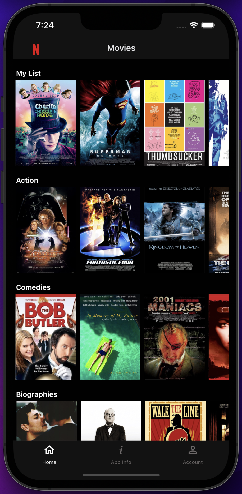
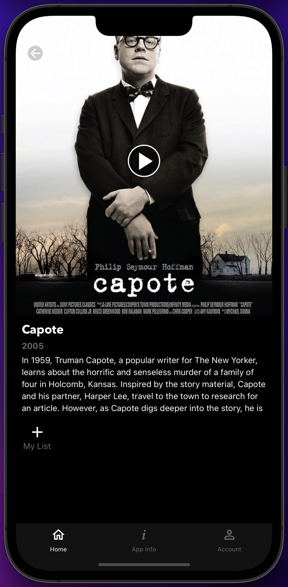
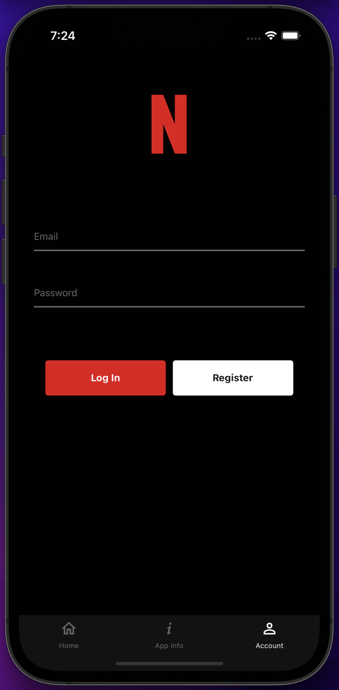
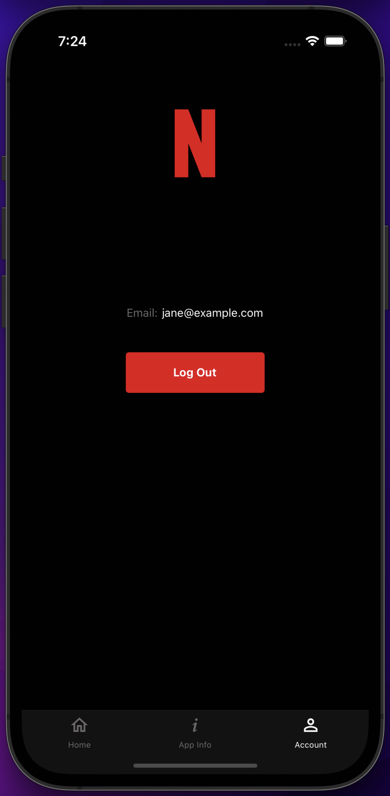

# A Netflix-Like App with Multiple Realms Using Atlas Device SDK for React Native

> [!WARNING]
> We announced the deprecation of Atlas Device Sync + Realm SDKs in September 2024. For more information please see:
> - [SDK Deprecation](https://www.mongodb.com/docs/atlas/device-sdks/deprecation/)
> - [Device Sync Deprecation](https://www.mongodb.com/docs/atlas/app-services/sync/device-sync-deprecation/)
>
> For a version of RealmJS without sync features, install from [community on npm](https://www.npmjs.com/package/realm/v/community) or see the `community` git branch.

A Netflix-like example app showcasing how to use different Realms in [MongoDB's Atlas Device SDK for React Native](https://www.mongodb.com/docs/realm/sdk/react-native/). All users can browse (not play) movies from MongoDB's [Mflix sample dataset](https://www.mongodb.com/docs/atlas/sample-data/sample-mflix/#std-label-mflix-movies), but only users who register with email and password are able to sync, read, add, and remove movies saved to "My List".

> This example app does not support playing any movies.

## Screenshots

<div style="display: flex">
  
  
  
  
</div>

## Project Structure

The following shows the project structure and the most relevant files.

> To learn more about the backend file structure, see [App Configuration](https://www.mongodb.com/docs/atlas/app-services/reference/config/).

```
├── backend                           - App Services App
│   └── (see link above)
│
├── frontend                          - React Native App
│   ├── app
│   │   ├── atlas-app-services
│   │   │   └── config.ts             - Add App ID
│   │   │
│   │   ├── components
│   │   │   ├── MovieItem.tsx         - Movie list item
│   │   │   ├── MovieList.tsx         - Horizontal movie list
│   │   │   └── PublicLogin.tsx       - Logs in public/anonymous users
│   │   │
│   │   ├── hooks
│   │   │   └── useAccountInfo.ts     - Provides account info
│   │   │
│   │   ├── models
│   │   │   ├── Movie.ts              - Mflix movie data model
│   │   │   └── PrivateContent.ts     - Data for private users
│   │   │
│   │   ├── navigation
│   │   │   ├── MoviesNavigator.tsx   - Navigates movie screens
│   │   │   ├── RootNavigator.tsx     - Navigates bottom tabs
│   │   │   └── routes.ts             - Available routes
│   │   │
│   │   ├── providers
│   │   │   └── MovieProvider.tsx     - Queries and updates data
│   │   │
│   │   ├── screens
│   │   │   ├── AccountScreen.tsx     - Login and account info
│   │   │   ├── MovieInfoScreen.tsx   - Movie info and add to My List
│   │   │   └── MoviesScreen.tsx      - Movies grouped by category
│   │   │
│   │   ├── App.tsx                   - Provides the App Services App
│   │   └── AuthenticatedApp.tsx      - Opens different Realms
│   │
│   ├── index.js                      - Entry point
│   └── package.json                  - Dependencies
│
└── README.md                         - Instructions and info
```

## Use Cases

This app focuses on showing how multiple Realms can be used. The `AuthenticatedApp` component renders [@realm/react's](https://www.npmjs.com/package/@realm/react) `RealmProvider` available for opening a Realm and providing it to the child components in its React subtree. It will open different Realms (but only one is kept open at any given time in this app) depending on whether or not the account is "public/anonymous". Users that log in using email and password will be treated as private accounts with the ability to manage "My List".

It specifically addresses the following points:

* Using a "public" Realm and automatically logging in users using [Anonymous Authentication](https://www.mongodb.com/docs/atlas/app-services/authentication/anonymous/).
  * Automatic login occurs in order to sync all public content (the Mflix dataset) to all users.
* Using a "private" Realm and logging in using [Email/Password Authentication](https://www.mongodb.com/docs/atlas/app-services/authentication/email-password/).
  * These users use a different Realm to additionally be able to sync, read, add, and remove movies saved to "My List".
* Configurations for opening a synced Realm.
  * Initial subscriptions are added to allow syncing of a subset of data to the device.
  * Realms are opened immediately without waiting for downloads from the server.
    * See [Offline Support](#note-offline-support) further below.
* Using an [Atlas Authentication Trigger](https://www.mongodb.com/docs/atlas/app-services/triggers/authentication-triggers/) and [Atlas Function](https://www.mongodb.com/docs/atlas/app-services/functions/).
  * The trigger is triggered when users register with email and password.
  * The trigger in turn calls a function to create a `PrivateContent` document containing the `myList` field.
* Using different [data access rules/permissions](https://www.mongodb.com/docs/atlas/app-services/rules/roles/#define-roles---permissions) for the "public" and "private" Realms.
  * See [Set Data Access Permissions](#set-data-access-permissions) further below.

### Note: Using Multiple Realms at the Same Time

This app uses multiple Realms, but only one Realm is kept open at any given time as only one `RealmProvider` is used, but with different configurations. You can also have `RealmProvider`s in different parts of the React tree, specifying different `path`s in order to open multiple Realms at the same time.

### Note: Offline Support

This app uses synced Realms as it needs to load the Mflix dataset from Atlas. Thus, for logging in, a network connection is required.

Users who have logged in at least once will have their credentials cached on the client. Thus, a logged in user who restarts the app will remain logged in. [@realm/react's](https://www.npmjs.com/package/@realm/react) `UserProvider` automatically handles this for you by checking if the `app.currentUser` already exists.

Data that was previously synced to the device will also exist locally in the Realm database. From this point on, users can be offline and still query and update data. Any changes made offline will be synced automatically to Atlas and any other devices once a network connection is established. If multiple users modify the same data either while online or offline, those conflicts are [automatically resolved](https://www.mongodb.com/docs/atlas/app-services/sync/details/conflict-resolution/) before being synced.

#### Realm Configuration

When [opening a Realm](https://www.mongodb.com/docs/realm/sdk/react-native/sync-data/configure-a-synced-realm/), we can specify the behavior in the Realm configuration when opening it for the first time (via `newRealmFileBehavior`) and for subsequent ones (via `existingRealmFileBehavior`). We can either:
* `OpenRealmBehaviorType.OpenImmediately`
  * Opens the Realm file immediately if it exists, otherwise it first creates a new empty Realm file then opens it.
  * This lets users use the app with the existing data, while syncing any changes to the device in the background.
* `OpenRealmBehaviorType.DownloadBeforeOpen`
  * If there is data to be downloaded, this waits for the data to be fully synced before opening the Realm.

This app opens a Realm via `RealmProvider` (see [AuthenticatedApp.tsx](./frontend/app/AuthenticatedApp.tsx)) and passes the configuration as props. We use `OpenImmediately` for new and existing Realm files in order to use the app while offline.

> See [OpenRealmBehaviorConfiguration](https://www.mongodb.com/docs/realm-sdks/js/latest/types/OpenRealmBehaviorConfiguration.html) for possible configurations of new and existing Realm file behaviors.

#### Loading Movie Posters

Each movie poster is loaded from a remote source and is not cached on the client for this example app. Therefore, if the user is offline, only the placeholder image will be shown as the poster.

## Getting Started

### Prerequisites

* [Node.js](https://nodejs.org/)
* [React Native development environment](https://reactnative.dev/docs/environment-setup?guide=native)
  * Refer to the **"React Native CLI Quickstart"**.

### Set up an Atlas Database with a Sample Dataset

1. [Deploy a free Atlas cluster](https://www.mongodb.com/docs/atlas/getting-started/#get-started-with-atlas) and create an Atlas database.
2. [Load the Sample Mflix Dataset](https://www.mongodb.com/docs/atlas/sample-data/) into your Atlas database.
    * Several databases and collections exist in the sample dataset, but we will only be using the `sample_mflix` database and its `movies` collection.

### Set up an Atlas App Services App

You can either choose to set up your App via a CLI (this has fewer steps and is much faster since all configurations are already provided in the [backend directory](./backend/)), or via the App Services UI (steps provided below).

#### Via a CLI (recommended)

To import and deploy changes from your local directory to App Services you can use the command line interface:

1. [Set up Realm CLI](https://www.mongodb.com/docs/atlas/app-services/cli/).
2. In the provided [backend directory](./backend/) (the App Services App), update the following:
    * Cluster Name
      * Update the `"clusterName"` in [data_sources/mongodb-atlas/config.json](./backend/data_sources/mongodb-atlas/config.json) to the name of your cluster.
      * (The default name is `Cluster0`.)
    * App ID
      * There is no `"app_id"` defined in [realm_config.json](./backend/realm_config.json) since we will create a brand new App. **If** you for some reason are updating an existing app, add an `"app_id"` field and its value.
3. [Push and deploy](https://www.mongodb.com/docs/atlas/app-services/cli/realm-cli-push/#std-label-realm-cli-push) the local directory to App Services:
```sh
realm-cli push --local <path to backend directory>
```
4. Once pushed, verify that your App shows up in the App Services UI and that both triggers have the status `Enabled`.
5. 🥳 You can now go ahead and [install dependencies and run the React Native app](#install-dependencies).

#### Via the App Services UI

To sync data used in this app you must first:

1. [Create an App Services App](https://www.mongodb.com/docs/atlas/app-services/manage-apps/create/create-with-ui/).
2. [Enable Email/Password Authentication](https://www.mongodb.com/docs/atlas/app-services/authentication/email-password/) and [Anonymous Authentication](https://www.mongodb.com/docs/atlas/app-services/authentication/anonymous/).
    * For this example app, we automatically confirm users' emails.
3. [Enable Flexible Sync](https://www.mongodb.com/docs/atlas/app-services/sync/configure/enable-sync/) with **Development Mode** enabled.
    * Select `sample_mflix` as the database to store new collections in.
    * When Development Mode is enabled, [queryable fields](https://www.mongodb.com/docs/atlas/app-services/sync/configure/sync-settings/#queryable-fields) will be added **automatically**, and schemas will be inferred based on the client Realm data models.
    * For information, queryable fields used in this app include:
      * Global (all collections): `_id`
      * `movies` collection: `title`, `fullplot`, `type`, `year`, `genres`, `poster`
      * `PrivateContent` collection: `userId`
    * (Development Mode should be turned off in production.)
4. Don't forget to click `Review Draft and Deploy`.

### Add Atlas Triggers and Functions

> If you set up your App Services App [via a CLI](#via-a-cli-recommended), you can **skip this step** as the triggers and functions should already be defined for you.

We will add a trigger that is automatically triggered when users register with email and password. This trigger in turn calls a function to create a `PrivateContent` document containing the `myList` field. When a user is deleted (e.g. by manually deleting them via the App Services UI) we also add a trigger and function for deleting the `PrivateContent` document.

To set this up via the App Services UI:

1. [Define two functions](https://www.mongodb.com/docs/atlas/app-services/functions/#define-a-function) with the following configurations:
    * Function name: `createPrivateContent`
      * Authentication: `Application Authentication`
      * Private: `true`
      * Code: See [backend function](./backend/functions/createPrivateContent.js)
    * Function name: `deletePrivateContent`
      * Authentication: `Application Authentication`
      * Private: `true`
      * Code: See [backend function](./backend/functions/deletePrivateContent.js)
2. [Define two triggers](https://www.mongodb.com/docs/atlas/app-services/triggers/authentication-triggers/#create-an-authentication-trigger) with the following configurations:
    * Trigger name: `onNewUser`
      * Trigger type: `Authentication`
      * Enabled: `true`
      * Action type: `Create`
      * Providers: `Email/Password`
      * Event type: `Function`
      * Function: `createPrivateContent`
    * Trigger name: `onDeletedUser`
      * Trigger type: `Authentication`
      * Enabled: `true`
      * Action type: `Delete`
      * Providers: `Email/Password`
      * Event type: `Function`
      * Function: `deletePrivateContent`

### Install Dependencies

From the [frontend directory](./frontend/), run:

```sh
npm install
```

If developing with iOS, also run:

```sh
npx pod-install
```

### Run the App

1. [Copy your Atlas App ID](https://www.mongodb.com/docs/atlas/app-services/reference/find-your-project-or-app-id/#std-label-find-your-app-id) from the App Services UI.
2. Paste the copied ID as the value of the existing variable `ATLAS_APP_ID` in [app/atlas-app-services/config.ts](./frontend/app/atlas-app-services/config.ts):
```js
import Config from 'react-native-config';

export const ATLAS_APP_ID = Config.ATLAS_APP_ID || 'YOUR_APP_ID';
```
-  Alternatively you can add a `.env` file to your project with the following contents:
   ```bash
   ATLAS_APP_ID=your_app_id
   ```
   This file is included in the `.gitignore` so that it won't be committed to any code repositories.
3. Start Metro (the JavaScript bundler) in its own terminal:
```sh
npm start
```
4. In another terminal, start the app:
```sh
# Open the app on an iOS simulator.
npm run ios

# Open the app on an Android emulator.
npm run android
```

> To run the app on an actual device, see React Native's [Running on Device](https://reactnative.dev/docs/running-on-device).

### Set Data Access Permissions

> If you set up your App Services App [via a CLI](#via-a-cli-recommended), you can **skip this step** as the permissions should already be defined for you.

After running the client app for the first time, [modify the rules](https://www.mongodb.com/docs/atlas/app-services/rules/roles/#define-roles---permissions) for the collections in the App Services UI for increased security.

* Collection: `movies`
  * Permissions: `readAll` (see [corresponding json](./backend/data_sources/mongodb-atlas/sample_mflix/movies/rules.json))
  * Explanation:
    * All users will be able to browse the movies on their device, but they should not be able to update, insert, or delete any movies.
* Collection: `PrivateContent`
  * Permissions: `readOwnWriteOwn` (see [corresponding json](./backend/data_sources/mongodb-atlas/sample_mflix/PrivateContent/rules.json))
  * Explanation:
    * Users who have registered with email and password each have a `PrivateContent` document. A user will be able to read and write to their own document (i.e. when `PrivateContent.userId === <App User ID>`), but not anyone else's. Therefore, we also do not allow the client to modify the `userId` field.

> To learn more and see examples of permissions depending on a certain use case, see [Device Sync Permissions Guide](https://www.mongodb.com/docs/atlas/app-services/sync/app-builder/device-sync-permissions-guide/#std-label-flexible-sync-permissions-guide) and [Data Access Role Examples](https://www.mongodb.com/docs/atlas/app-services/rules/examples/).

## Troubleshooting

A great help when troubleshooting is to look at the [Application Logs](https://www.mongodb.com/docs/atlas/app-services/activity/view-logs/) in the App Services UI.

### Permissions

If permission is denied:
  * Make sure your IP address is on the [IP Access List](https://www.mongodb.com/docs/atlas/app-services/security/network/#ip-access-list) for your App.
  * Make sure you have the correct data access permissions for the collections.
    * See [Set Data Access Permissions](#set-data-access-permissions) further above.

### Removing the Local Realm Database

Removing the local database can be useful for certain errors.

On an iOS simulator:
1. Press and hold the app icon on the Home Screen.
2. Choose to remove the app and its data.

On an Android emulator via Android Studio:
1. Quit the emulator if it is running.
2. Open `Device Manager`.
3. Select `Wipe Data` for the relevant emulator.
