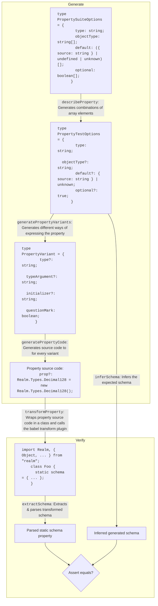

# Test Generator for the `@realm/babel-plugin` package

```mermaid
flowchart TD

classDef data text-align:left;

subgraph Generate
  nodePropertyTest["
    <code>type PropertySuiteOptions = {
      &nbsp;&nbsp;type: string;
      &nbsp;&nbsp;objectType: string[];
      &nbsp;&nbsp;default: ({ source: string } | undefined | unknown)[];
      &nbsp;&nbsp;optional: boolean[];
      }
    </code>
  "]
  nodePropertySchema["
    <code>type PropertyTestOptions = {
      &nbsp;&nbsp;type: string;
      &nbsp;&nbsp;objectType?: string;
      &nbsp;&nbsp;default?: { source: string } | unknown;
      &nbsp;&nbsp;optional?: true;
      }
    </code>
  "]
  nodePropertyVariant["
    <code>type PropertyVariant = {
      &nbsp;&nbsp;type?: string;
      &nbsp;&nbsp;typeArgument?: string;
      &nbsp;&nbsp;initializer?: string;
      &nbsp;&nbsp;questionMark: boolean;
      }
    </code>
  "]
  nodePropertyCode["
    Property source code:
    <code>prop?: Realm.Types.Decimal128 = new Realm.Types.Decimal128();</code>
  "]

  nodePropertyTest -->|<code>describeProperty</code>: Generates combinations of array elements| nodePropertySchema
  nodePropertySchema -->|<code>generatePropertyVariants</code>: Generates different ways of expressing the property| nodePropertyVariant
  nodePropertyVariant -->|<code>generatePropertyCode</code>: Generates source code to for every variant| nodePropertyCode

  class nodePropertyTest,nodePropertySchema,nodePropertyVariant,nodeSourceCode data;
end

nodePropertyCode -->|<code>transformProperty</code>: Wraps property source code in a class and calls the babel transform plugin| nodeTransformedCode

subgraph Verify
  nodeTransformedCode["
    <code>import Realm, { Object, ... } from #quot;realm#quot;;
    class Foo {
    #nbsp;#nbsp;static schema = { ... };
    }
    </code>
  "]

  nodeStaticSchema["
    Parsed static schema property
  "]

  nodeExpectedSchema["
    Inferred generated schema
  "]

  nodeTransformedCode -->|<code>extractSchema</code>: Extracts & parses transformed schema| nodeStaticSchema

  nodePropertySchema -->|<code>inferSchema</code>: Infers the expected schema| nodeExpectedSchema

  nodeAssert{Assert equals?}
  nodeStaticSchema --> nodeAssert
  nodeExpectedSchema --> nodeAssert

  class nodeTransformedCode data;
end

```
