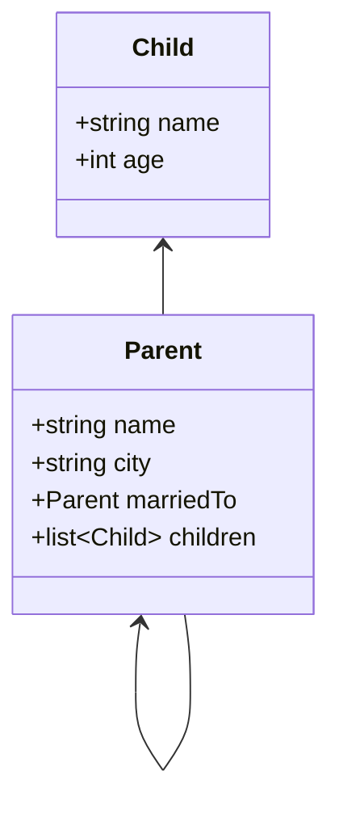

# Tools for Realm

## Introduction

This package contains various tools for working with Realm files. Each tool is briefly documented here.

## Installation

The prerequisite for installing the `@realm/tools` package is a working [node.js](https://nodejs.org/en/) and a package manager.

npm:

```sh
npm install -g @realm/tools
```

yarn:

```sh
yarn global add @realm/tools
```

## Building

Source code for all tools are found in `src`. The output of the build process is found in `dist`.

```sh
npm install
npm run build
```

You can run the transpiled tools directly e.g.,

```sh
node dist/realm-schema.js -h
```

## `realm-schema`

The `realm-schema` can read a local Realm file and export the schema. The support output formats are:

* JSON
* [Mermaid](https://mermaid-js.github.io/mermaid/#/) compatible class diagram

Example:

```sh
npx realm-schema -i samples/default.realm -o MyClasses.mmd -f mermaid
```

The output will look like


If you plan to use the JSON output, it is recommended to use it with [jq](https://stedolan.github.io/jq/).